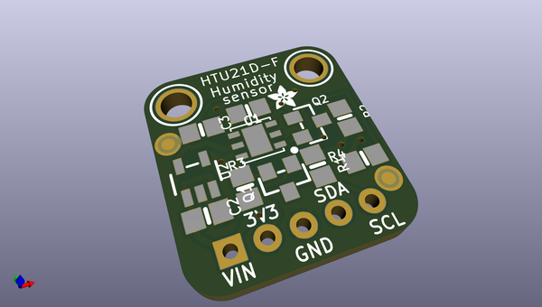
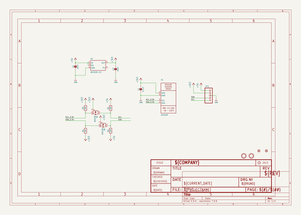
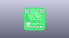
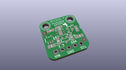
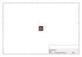
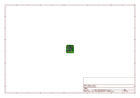
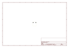
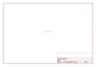
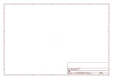
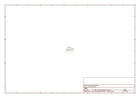

# OOMP Project  
## Adafruit-HTU21D-Breakout-PCB  by adafruit  
  
oomp key: oomp_projects_flat_adafruit_adafruit_htu21d_breakout_pcb  
(snippet of original readme)  
  
-- Adafruit HTU21D Breakout PCB  
<a href="http://www.adafruit.com/products/1899">   
<a href="http://www.adafruit.com/products/1899">   
Click here to purchase one from the Adafruit shop</a>  
  
The HTU21D-F Temperature + Humidity Sensor - the best way to prove the weatherman wrong!  
  
This I2C digital humidity sensor is an accurate and intelligent alternative to the much simpler Humidity and Temperature Sensor - SHT15 Breakout It has a typical accuracy of ±2% with an operating range that's optimized from 5% to 95% RH. Operation outside this range is still possible - just the accuracy might drop a bit. The temperature output has an accuracy of ±1°C from -30~90°C. If you're looking to measure temperature more accurately, we recommend the MCP9808 High Accuracy I2C Temperature Sensor Breakout Board.  
  
To get you going fast, we spun up a custom made PCB in the STEMMA QT form factor, making them easy to interface with. The STEMMA QT connectors on either side are compatible with the SparkFun Qwiic I2C connectors. This allows you to make solderless connections between your development board and the HTU21Ds or to chain them with a wide range of other sensors and accessories using a compatible cable. QT Cable is not included, but we have a variety in the shop.  
  
PCB files for the Adafruit HTU21D Breakout. The format is EagleCAD schematic and board layout  
- https://www.adafruit.com/products  
  full source readme at [readme_src.md](readme_src.md)  
  
source repo at: [https://github.com/adafruit/Adafruit-HTU21D-Breakout-PCB](https://github.com/adafruit/Adafruit-HTU21D-Breakout-PCB)  
## Board  
  
  
## Schematic  
  
  
  
[schematic pdf](working_schematic.pdf)  
## Images  
  
  
  
  
  
  
  
  
  
  
  
  
  
  
  
  
