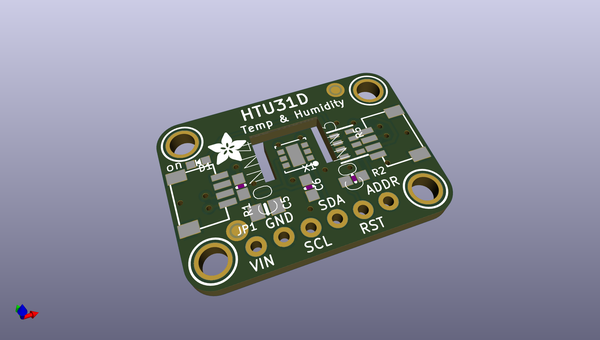
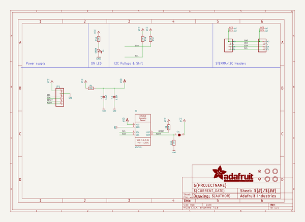
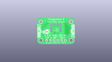
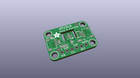
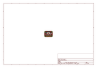
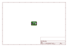
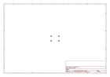
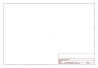
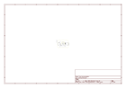

# OOMP Project  
## Adafruit-HTU31-PCB  by adafruit  
  
(snippet of original readme)  
  
-- Adafruit HTU31 Temperature & Humidity Sensor Breakout Board PCB  
  
<a href="http://www.adafruit.com/products/4832">   
Click here to purchase one from the Adafruit shop</a>  
  
PCB files for the Adafruit HTU31 Temperature & Humidity Sensor Breakout Board.   
  
Format is EagleCAD schematic and board layout  
* https://www.adafruit.com/product/4832  
  
--- Description  
  
The HTU31-D is the third generation of temperature-humidity sensors from TE - and a great follow-up to the popular HTU21-D sensor. Like the HTU21, the '31 is great for sensing temperature and humidity, with excellent specifications.  
  
This I2C digital humidity sensor is an accurate and intelligent alternative to the common DHT-series sensors, at about the same price! It has a typical accuracy of ±2% at 20% to 100% relative humidity, at a temperature range of 0 to 70°C. Operation outside this range is still possible - just the accuracy might drop a bit. The temperature output has an accuracy of ±0.2°C from -0~100°C, on par with the better quality on-chip sensors we've stocked.  
  
The sensor also has an on-board heater that can be controlled on and off to help evaporate condensation on the sensing element. Of course, temperature sensing will not be accurate with the heater on. Data reads come with CRC, so you can be more confident of data that is read compared to other I2C sensors.  
  
Other nice extras: a hardware reset pin, an address-select pin so you can have two on one I2C b  
  full source readme at [readme_src.md](readme_src.md)  
  
source repo at: [https://github.com/adafruit/Adafruit-HTU31-PCB](https://github.com/adafruit/Adafruit-HTU31-PCB)  
## Board  
  
  
## Schematic  
  
  
  
[schematic pdf](working_schematic.pdf)  
## Images  
  
  
  
  
  
  
  
  
  
  
  
  
  
  
  
  
