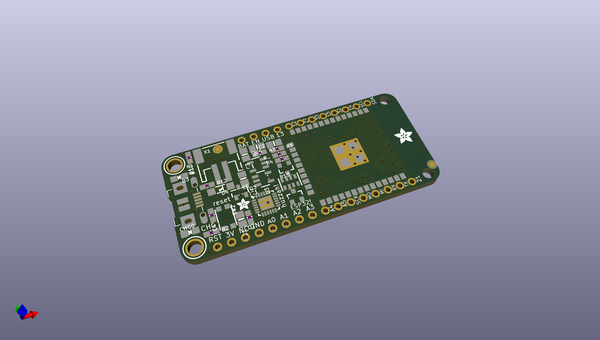
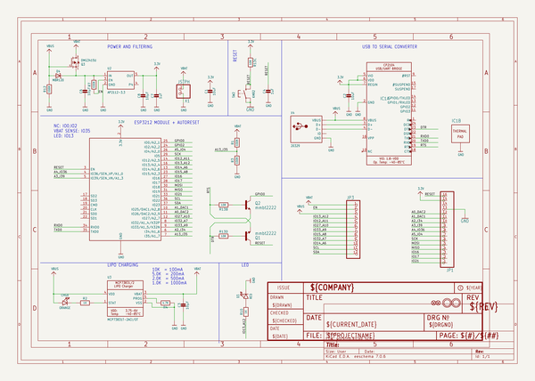
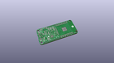
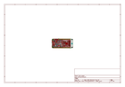
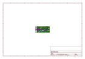
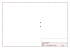
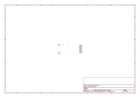
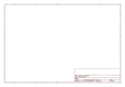
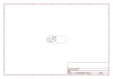

# OOMP Project  
## Adafruit-HUZZAH32-ESP32-Feather-PCB  by adafruit  
  
(snippet of original readme)  
  
-- Adafruit HUZZAH32 ESP32 Feather  
  
<a href="http://www.adafruit.com/products/3405">   
Click here to purchase one from the Adafruit shop</a>  
  
PCB files for the Adafruit Feather ESP32 HUZZAH32. Format is EagleCAD schematic and board layout  
  
For more details, check out the product page at  
* https://www.adafruit.com/product/3405  
  
--- Description  
  
Aww yeah, it's the Feather you have been waiting for! The HUZZAH32 is our ESP32-based Feather, made with the official WROOM32 module. We packed everything you love about Feathers: built in USB-to-Serial converter, automatic bootloader reset, Lithium Ion/Polymer charger, and just about all of the GPIOs brought out so you can use it with any of our Feather Wings. We have other boards in the Feather family, check'em out here.  
  
That module nestled in at the end of this Feather contains a dual-core ESP32 chip, 4 MB of SPI Flash, tuned antenna, and all the passives you need to take advantage of this powerful new processor. The ESP32 has both WiFi and Bluetooth Classic/LE support. That means it's perfect for just about any wireless or Internet-connected project.  
  
Because it's part of our Feather eco-system, you can take advantage of the 50+ Wings that we've designed to add all sorts of cool accessories.  
  
The ESP32 is a perfect upgrade from the ESP8266 that has been so popular. In comparison, the ESP32 has way more GPIO, plenty of analog inputs, two analog outputs, multiple extra peripherals  
  full source readme at [readme_src.md](readme_src.md)  
  
source repo at: [https://github.com/adafruit/Adafruit-HUZZAH32-ESP32-Feather-PCB](https://github.com/adafruit/Adafruit-HUZZAH32-ESP32-Feather-PCB)  
## Board  
  
  
## Schematic  
  
  
  
[schematic pdf](working_schematic.pdf)  
## Images  
  
  
  
  
  
  
  
  
  
  
  
  
  
  
  
  
