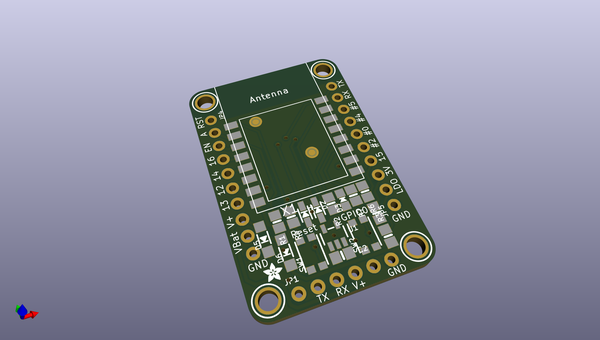
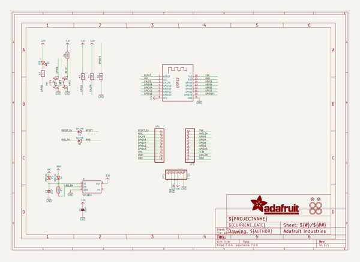
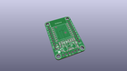
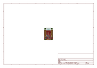
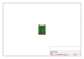
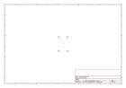
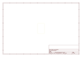
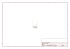

# OOMP Project  
## Adafruit-Huzzah-ESP8266-Basic-Breakout-PCB  by adafruit  
  
oomp key: oomp_projects_flat_adafruit_adafruit_huzzah_esp8266_basic_breakout_pcb  
(snippet of original readme)  
  
- Adafruit Huzzah ESP8266 Basic Breakout PCB  
<a href="http://www.adafruit.com/products/2471">   
Click here to purchase one from the Adafruit shop</a>  
  
Add Internet to your next project with an adorable, bite-sized WiFi microcontroller, at a price you like! The ESP8266 processor from Espressif is an 80 MHz microcontroller with a full WiFi front-end (both as client and access point) and TCP/IP stack with DNS support as well. While this chip has been very popular, its also been very difficult to use. Most of the low cost modules are not breadboard friendly, don't have an onboard 500mA 3.3V regulator or level shifting, and aren't CE or FCC emitter certified....UNTIL NOW!  
  
The Adafruit HUZZAH ESP8266 breakout is what we designed to make working with this chip super easy and a lot of fun. We took a certified module with an onboard antenna, and plenty of pins, and soldered it onto our designed breakout PCBs.  
  
PCB files for Adafruit Huzzah ESP8266 Basic Breakout, The format is EagleCAD schematic and board layout  
  
For more details, check out the product page at http://www.adafruit.com/products/2471  
  
--- License  
  
Adafruit invests time and resources providing this open source design, please support Adafruit and open-source hardware by purchasing products from [Adafruit](https://www.adafruit.com)!  
  
All text above must be included in any redistribution  
  
Designed by Limor Fried/Ladyada for Adafruit Industries.  
Creative Commons Attributio  
  full source readme at [readme_src.md](readme_src.md)  
  
source repo at: [https://github.com/adafruit/Adafruit-Huzzah-ESP8266-Basic-Breakout-PCB](https://github.com/adafruit/Adafruit-Huzzah-ESP8266-Basic-Breakout-PCB)  
## Board  
  
  
## Schematic  
  
  
  
[schematic pdf](working_schematic.pdf)  
## Images  
  
  
  
  
  
  
  
  
  
  
  
  
  
  
  
  
