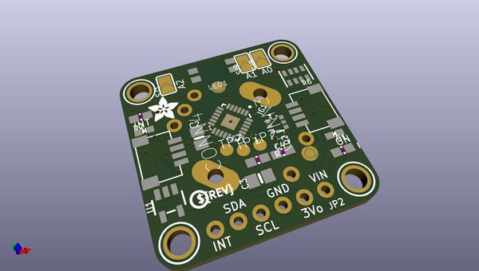

# OOMP Project  
## Adafruit-I2C-QT-Rotary-Encoder-PCB  by adafruit  
  
(snippet of original readme)  
  
-- Adafruit I2C QT Rotary Encoder with NeoPixel - STEMMA QT / Qwiic PCB  
  
<a href="http://www.adafruit.com/products/4991">   
Click here to purchase one from the Adafruit shop</a>  
  
PCB files for the Adafruit I2C QT Rotary Encoder with NeoPixel - STEMMA QT / Qwiic.   
  
Format is EagleCAD schematic and board layout  
* https://www.adafruit.com/product/4991  
  
--- Description  
  
Rotary encoders are soooo much fun! Twist em this way, then twist them that way. Unlike potentiometers, they go all the way around, and often have little detents for tactile feedback. But, if you've ever tried to add encoders to your project you know that they're a real challenge to use: timers, interrupts, debouncing...  
  
This Stemma QT breakout makes all that frustration go away - solder in any 'standard' PEC11-pinout rotary encoder with or without a push-switch. The onboard microcontroller is programmed with our seesaw firmware and will track all pulses and pins for you and then save the incremental value for querying at any time over I2C. Plug it in with a Stemma QT cable for instant rotary goodness, with any kind of microcontroller from an Arduino UNO up to a Raspberry Pi.  
  
You can use our Arduino library to control and read data with any compatible microcontroller. We also have CircuitPython/Python code for use with computers or single-board Linux boards.  
  
It's also easy to add this breakout to a breadboard - with six 0.1"-spaced breakout pads. Power with 3  
  full source readme at [readme_src.md](readme_src.md)  
  
source repo at: [https://github.com/adafruit/Adafruit-I2C-QT-Rotary-Encoder-PCB](https://github.com/adafruit/Adafruit-I2C-QT-Rotary-Encoder-PCB)  
## Board  
  
  
## Schematic  
  
  
  
[schematic pdf](working_schematic.pdf)  
## Images  
  
  
  
  
  
  
  
  
  
  
  
  
  
  
  
  
