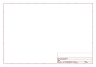

# OOMP Project  
## Adafruit-I2C-SPI-LCD-Backpack-PCB  by adafruit  
  
oomp key: oomp_projects_flat_adafruit_adafruit_i2c_spi_lcd_backpack_pcb  
(snippet of original readme)  
  
- i2c / SPI character LCD backpack  
  
<a href="http://www.adafruit.com/products/292">   
Click here to purchase one from the Adafruit shop  
</a>  
  
LCD backpacks reduce the number of pins needed to connect to an LCD. LCDs are a fun and easy way to have your microcontroller project talk back to you. Character LCDs are common, and easy to get, available in tons of colors and sizes. [We've written tutorials on using character LCDs with an Arduino](http://learn.adafruit.com/character-lcds) (or similar microcontroller) but find that the number of pins necessary to control the LCD can be restrictive, especially with ambitious projects. We wanted to make a 'backpack' (add-on circuit) that would reduce the number of pins without a lot of expense.  
  
By using simple i2c and SPI input/output expanders we have reduced the number of pins (only 2 pins are needed for i2c) while still making it easy to interface with the LCD. For Arduino users, we provide a easy-to-use library that is backwards compatible with projects using the '6 pin' wiring. The breakout comes with a 2-pin and 3-pin terminal block as shown (you can snap it together to make a 5-pin terminal and then solder it to the backpack for easy wiring)  
  
This backpack will work with any 'standard' character LCD, from 8x1 to 20x4 sizes! As long as they have a 16-pin single-line connection header at the top. [We carry a few LCDs that work great](http://www.adafruit.com/category/63_96). We   
  full source readme at [readme_src.md](readme_src.md)  
  
source repo at: [https://github.com/adafruit/Adafruit-I2C-SPI-LCD-Backpack-PCB](https://github.com/adafruit/Adafruit-I2C-SPI-LCD-Backpack-PCB)  
## Board  
  
  
## Schematic  
  
  
  
[schematic pdf](working_schematic.pdf)  
## Images  
  
  
  
  
  
  
  
  
  
  
  
  
  
  
  
  
