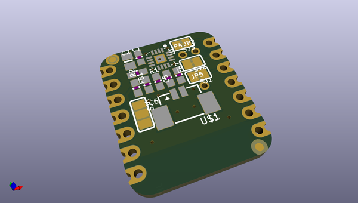
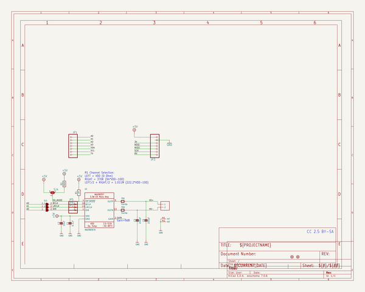
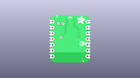
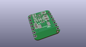
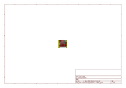
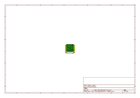
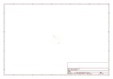
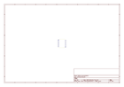

# OOMP Project  
## Adafruit-I2S-Amplifier-BFF-PCB  by adafruit  
  
(snippet of original readme)  
  
-- Adafruit I2S Amplifier BFF PCB  
  
<a href="http://www.adafruit.com/products/5770">   
Click here to purchase one from the Adafruit shop</a>  
  
PCB files for the Adafruit I2S Amplifier BFF.   
  
Format is EagleCAD schematic and board layout  
* https://www.adafruit.com/product/5770  
  
--- Description  
  
Our QT Py boards are a great way to make very small microcontroller projects that pack a ton of power - and now we have a way for you to add an I2S 3 Watt amplifier, for high quality audio playback, that can fit on the back of your miniature dev board. It uses just three GPIO pins that do not intersect with the I2C/UART or SPI port.  
  
We call this the Adafruit I2S Amp BFF - a "Best Friend Forever". When you were a kid you may have learned about the "buddy" system, well this product is kinda like that! A board that will watch your QT Py's back and give it more capabilities.  
  
This PCB is designed to fit onto the back of any QT Py or Xiao board, it can be soldered into place or use pin and socket headers to make it removable. Onboard is a MAX98357 audio amplifier and picoblade-compatible connector for plugigng in a 4 or 8 ohm speaker. We use A0 for the audio data, A1 for wordselect clock, and A2 for bitclock. This pinout will work with ESP32 series, nRF52840 and RP2040 chipset boards. It won't work with the ATSAMD21 'original 'QT Py because those pins on the SAMD21 are not I2S capable. However, you could cut and rewire the traces to connect  
  full source readme at [readme_src.md](readme_src.md)  
  
source repo at: [https://github.com/adafruit/Adafruit-I2S-Amplifier-BFF-PCB](https://github.com/adafruit/Adafruit-I2S-Amplifier-BFF-PCB)  
## Board  
  
  
## Schematic  
  
  
  
[schematic pdf](working_schematic.pdf)  
## Images  
  
  
  
  
  
  
  
  
  
  
  
  
  
  
  
  
