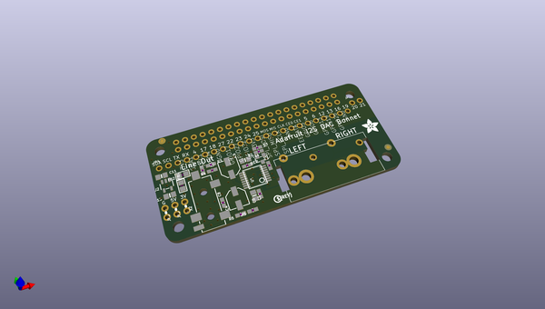
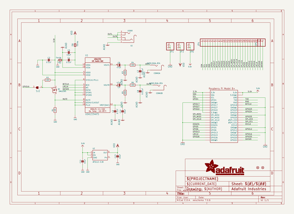
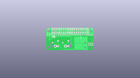
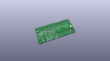
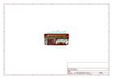
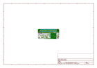
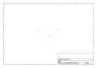
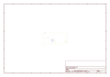
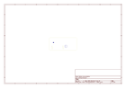
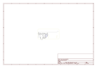

# OOMP Project  
## Adafruit-I2S-Audio-Bonnet-for-Raspberry-Pi-PCB  by adafruit  
  
oomp key: oomp_projects_flat_adafruit_adafruit_i2s_audio_bonnet_for_raspberry_pi_pcb  
(snippet of original readme)  
  
-- Adafruit I2S Audio Bonnet for Raspberry Pi - UDA1334A PCB  
  
<a href="http://www.adafruit.com/products/4037">   
Click here to purchase one from the Adafruit shop</a>  
  
PCB files for the Adafruit I2S Audio Bonnet for Raspberry Pi - UDA1334A. Format is EagleCAD schematic and board layout  
* https://www.adafruit.com/product/4037  
  
--- Description  
  
Add some easy-listenin' tunes to your Raspberry Pi using this basic audio bonnet. It'll give you stereo line out from a digital I2S converter for a good price, and sounds nice to boot! This bonnet features the UDA1334A I2S Stereo DAC, a perfect match for any I2S-output audio interface. It's affordable but sounds great - music to our ears.  
  
It's the exact same size as a Raspberry Pi Zero but works with **any and all** Raspberry Pi computers with a 2x20 connector - A+, B+, Zero, Pi 2, Pi 3, etc. We've tested it out with Raspbian (the official operating system) and Retropie.  
  
This Bonnet uses I2S a digital sound standard, so you get really crisp audio. The digital data goes right into the amplifier so there's no static like you hear from the onboard headphone jack. And it's super easy to get started. Just plug in any line level output into powered speakers or audio system. You can plug in headphones but you'll get some distortion - so its best used into something that is expecting line level out  
  
Each order comes as a fully tested and assembled PCB with a 2x20 socket connector. No solderi  
  full source readme at [readme_src.md](readme_src.md)  
  
source repo at: [https://github.com/adafruit/Adafruit-I2S-Audio-Bonnet-for-Raspberry-Pi-PCB](https://github.com/adafruit/Adafruit-I2S-Audio-Bonnet-for-Raspberry-Pi-PCB)  
## Board  
  
  
## Schematic  
  
  
  
[schematic pdf](working_schematic.pdf)  
## Images  
  
  
  
  
  
  
  
  
  
  
  
  
  
  
  
  
