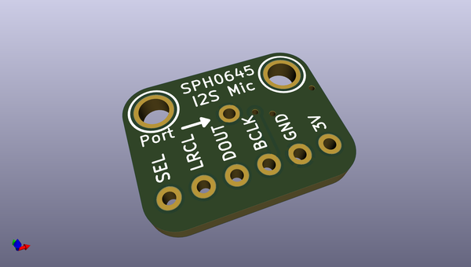
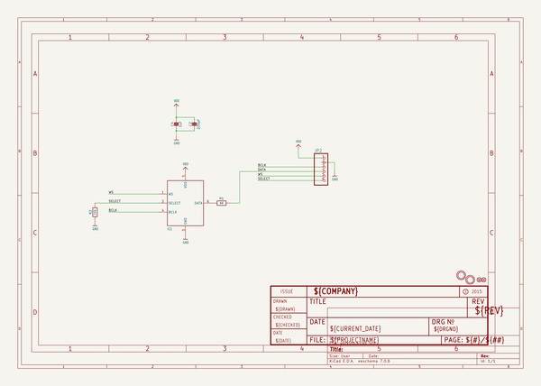

# OOMP Project  
## Adafruit-I2S-Microphone-Breakout-PCB  by adafruit  
  
(snippet of original readme)  
  
-- Adafruit I2S Microphone Breakout PCB  
  
<a href="http://www.adafruit.com/products/3421">   
Click here to purchase one from the Adafruit shop</a>  
  
PCB files for the Adafruit I2S Microphone Breakout. Format is EagleCAD schematic and board layout  
* https://www.adafruit.com/products/3421  
  
--- Description  
  
Listen to this good news - we now have a breakout board for a super tiny I2S MEMS microphone. Just like 'classic' electret microphones, MEMS mics can detect sound and convert it to voltage, but they're way smaller and thinner. This microphone doesn't even have analog out, its purely digital. The I2S is a small, low cost MEMS mic with a range of about 50Hz - 15KHz, good for just about all general audio recording/detection.  
  
For many microcontrollers, adding audio input is easy with one of our analog microphone breakouts. But as you get to bigger and better microcontrollers and microcomputers, you'll find that you don't always have an analog input, or maybe you want to avoid the noise that can seep in with an analog mic system. Once you get past 8-bit micros, you will often find an I2S peripheral, that can take digital audio data in! That's where this I2S Microphone Breakout comes in.  
  
Instead of an analog output, there are three digital pins: Clock, Data and Left-Right (Word Select) Clock. When connected to your microcontroller/computer, the 'I2S Master' will drive the clock and word-select pins at a high frequency and read o  
  full source readme at [readme_src.md](readme_src.md)  
  
source repo at: [https://github.com/adafruit/Adafruit-I2S-Microphone-Breakout-PCB](https://github.com/adafruit/Adafruit-I2S-Microphone-Breakout-PCB)  
## Board  
  
  
## Schematic  
  
  
  
[schematic pdf](working_schematic.pdf)  
## Images  
  
  
  
  
  
  
  
  
  
  
  
  
  
  
  
  
