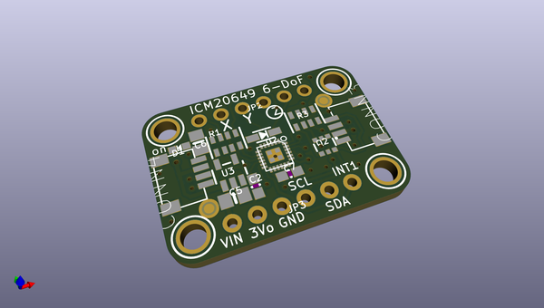
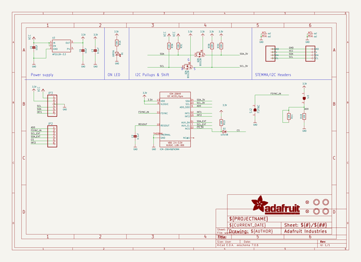
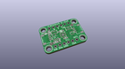
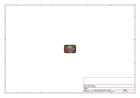
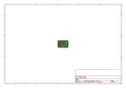
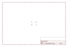
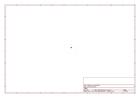
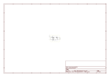

# OOMP Project  
## Adafruit-ICM20649-PCB  by adafruit  
  
(snippet of original readme)  
  
-- Adafruit ICM20649 Wide-Range 6-DoF IMU PCB  
  
<a href="http://www.adafruit.com/products/4464">   
Click here to purchase one from the Adafruit shop</a>  
  
PCB files for the Adafruit ICM20649 Wide-Range 6-DoF IMU.   
  
Format is EagleCAD schematic and board layout  
* https://www.adafruit.com/product/4464  
  
--- Description  
  
INSERT PRODUCT COPY HERE  
  
--- License  
  
Adafruit invests time and resources providing this open source design, please support Adafruit and open-source hardware by purchasing products from [Adafruit](https://www.adafruit.com)!  
  
Designed by Limor Fried/Ladyada for Adafruit Industries.  
  
Creative Commons Attribution/Share-Alike, all text above must be included in any redistribution.   
See license.txt for additional details.  
  
  full source readme at [readme_src.md](readme_src.md)  
  
source repo at: [https://github.com/adafruit/Adafruit-ICM20649-PCB](https://github.com/adafruit/Adafruit-ICM20649-PCB)  
## Board  
  
  
## Schematic  
  
  
  
[schematic pdf](working_schematic.pdf)  
## Images  
  
  
  
  
  
  
  
  
  
  
  
  
  
  
  
  
