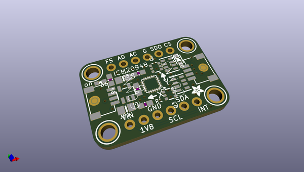
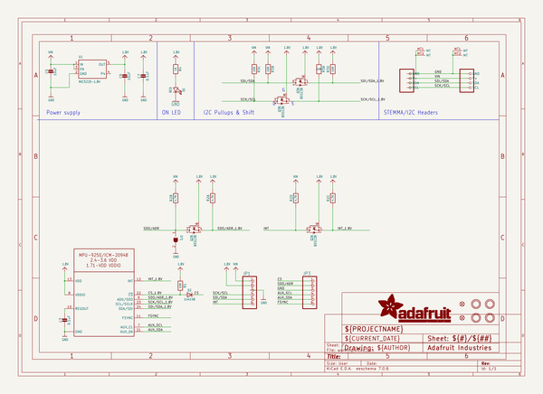
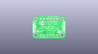
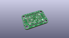
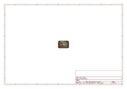
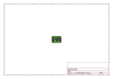
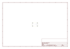
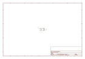

# OOMP Project  
## Adafruit-ICM20948-PCB  by adafruit  
  
oomp key: oomp_projects_flat_adafruit_adafruit_icm20948_pcb  
(snippet of original readme)  
  
-- Adafruit ICM20948 9-DoF IMU PCB  
  
<a href="http://www.adafruit.com/products/4554">   
Click here to purchase one from the Adafruit shop</a>  
  
PCB files for the Adafruit ICM20948 9-DoF IMU.   
  
Format is EagleCAD schematic and board layout  
* https://www.adafruit.com/product/4554  
  
--- Description  
When you want to sense orientation using inertial measurements, you need an Inertial Measurement Unit, and when it comes to IMUs, the more DoFs, the better! The ICM20948 from Invensense packs 9 Degrees of freedom into a teeny package, making it a one stop shop for all the DOFs you need! Within it’s svelte 3x3mm package there are not just one MEMS sensor die like your common sensors, but two sensor dies! The ICM20948 pair’s Invensense’s MEMS 3-axis accelerometer and gyro with the AK09916 3-axis magnetometer from Asahi Kasei Microdevices Corporation.  
  
 All 9 axes of measurement are made available thanks to a crew of 16-bit Analog to Digital Converters, diligently converting the raw analog signals from the MEMs sensors to digital readings that are accessed via I2C or SPI. Each of the sensors have the quality specs you would expect from such a sensor. Just see what the datasheet has to say:  
  
• 3-Axis Gyroscope with Programmable FSR of ±250 dps, ±500 dps, ±1000 dps, and ±2000 dps  
  
• 3-Axis Accelerometer with Programmable FSR of ±2g, ±4g, ±8g, and ±16g  
  
• 3-Axis Compass with a wide range to ±4900 µT  
  
Now that’s a handy and capable team of se  
  full source readme at [readme_src.md](readme_src.md)  
  
source repo at: [https://github.com/adafruit/Adafruit-ICM20948-PCB](https://github.com/adafruit/Adafruit-ICM20948-PCB)  
## Board  
  
  
## Schematic  
  
  
  
[schematic pdf](working_schematic.pdf)  
## Images  
  
  
  
  
  
  
  
  
  
  
  
  
  
  
  
  
