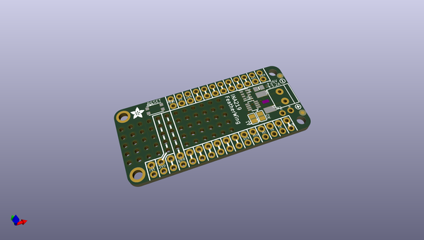
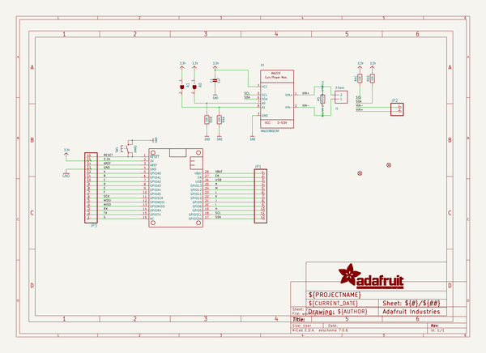
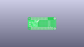
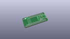
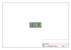
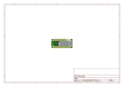
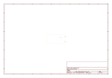
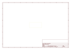
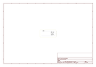

# OOMP Project  
## Adafruit-INA219-Current-Sensor-PCB  by adafruit  
  
(snippet of original readme)  
  
-- Adafruit INA219 Current Sensor PCB  
  
<a href="http://www.adafruit.com/products/904">   
Click here to purchase one from the Adafruit shop</a>  
<a href="http://www.adafruit.com/products/3650">   
Click here to purchase one from the Adafruit shop</a>  
  
PCB files for the Adafruit INA219 Current Sensor.   
  
Format is EagleCAD schematic and board layout  
* https://www.adafruit.com/product/904  
* https://www.adafruit.com/product/3650  
  
--- Description  
  
The INA219 will solve all your power-monitoring problems. Instead of struggling with two multimeters, you can just use the handy INA219B chip to both measure both the high side voltage and DC current draw over I2C with 1% precision.  
  
Most current-measuring devices such as our current panel meter are only good for low side measuring. That means that unless you want to get a battery involved, you have to stick the measurement resistor between the target ground and true ground. This can cause problems with circuits since electronics tend to not like it when the ground references change and move with varying current draw. This chip is much smarter - it can handle high side current measuring, up to +26VDC, even though it is powered with 3 or 5V. It will also report back that high side voltage, which is great for tracking battery life or solar panels.  
  
A precision amplifier measures the voltage across the 0.1 ohm, 1% sense resistor. Since the   
  full source readme at [readme_src.md](readme_src.md)  
  
source repo at: [https://github.com/adafruit/Adafruit-INA219-Current-Sensor-PCB](https://github.com/adafruit/Adafruit-INA219-Current-Sensor-PCB)  
## Board  
  
  
## Schematic  
  
  
  
[schematic pdf](working_schematic.pdf)  
## Images  
  
  
  
  
  
  
  
  
  
  
  
  
  
  
  
  
