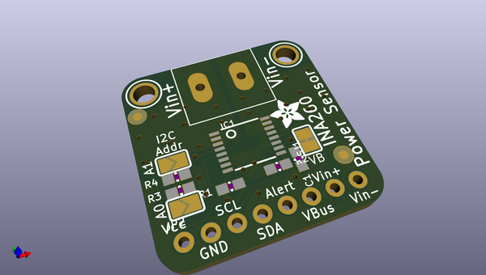
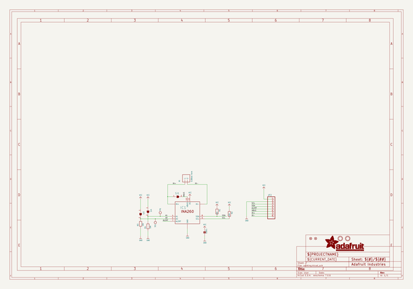
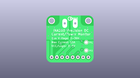
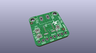
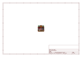
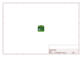
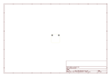
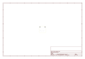
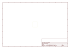
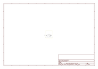

# OOMP Project  
## Adafruit-INA260-PCB  by adafruit  
  
oomp key: oomp_projects_flat_adafruit_adafruit_ina260_pcb  
(snippet of original readme)  
  
-- Adafruit INA260 High or Low Side Current and Power Sensor PCB  
  
<a href="http://www.adafruit.com/products/4226">   
Click here to purchase one from the Adafruit shop</a>  
  
PCB files for the Adafruit INA260 High or Low Side Current and Power Sensor.   
  
Format is EagleCAD schematic and board layout  
* https://www.adafruit.com/product/4226  
  
--- Description  
  
This breakout board may well be the last current sensing solution you every need to buy. Not only can it do the work of two multimeters, but it can do it with amazing precision and flexibility. With it you can measure high or low side DC current, the bus voltage, and have it automatically calculate the power. It can do so over impressive voltage, current, and temperature ranges with better than 1% accuracy, all while delivering the data in an easy to use format over I2C.  
  
Works great with any microcontroller that is CircuitPython or Arduino compatible as well as single board computers such as the Raspberry Pi. It is compatible with 3V or 5V logic and can measure bus voltages up to **+36VDC. Not for use with AC voltages**.  
  
Most current-measuring devices operate with some notable constraints that limit what they can be used for. Many are low-side only which can cause issues as the ground reference changes with current. Others like its little sister the INA219B avoid this by measuring on the high side but need to change their shunt resistor to measure different current ranges.   
  full source readme at [readme_src.md](readme_src.md)  
  
source repo at: [https://github.com/adafruit/Adafruit-INA260-PCB](https://github.com/adafruit/Adafruit-INA260-PCB)  
## Board  
  
  
## Schematic  
  
  
  
[schematic pdf](working_schematic.pdf)  
## Images  
  
  
  
  
  
  
  
  
  
  
  
  
  
  
  
  
