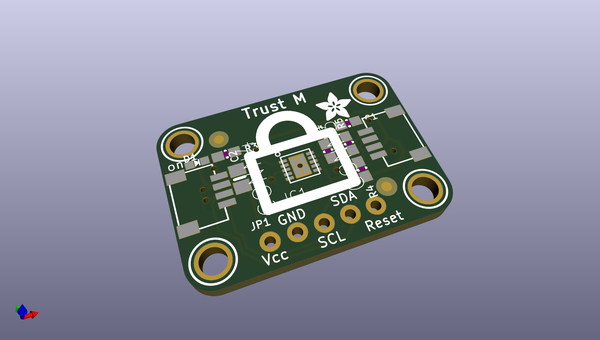
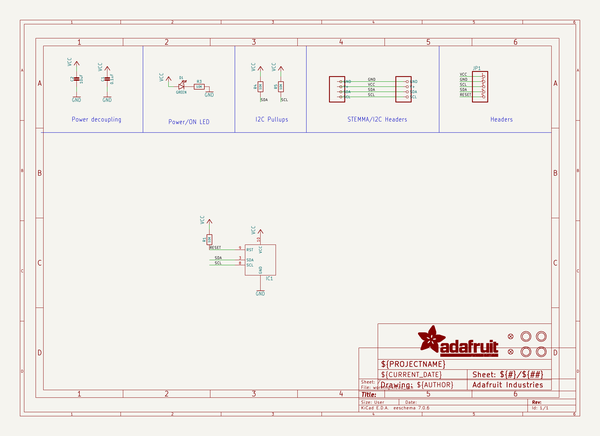
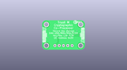
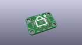
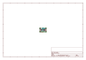
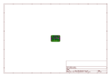
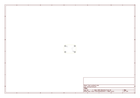

# OOMP Project  
## Adafruit-Infineon-Trust-M-PCB  by adafruit  
  
oomp key: oomp_projects_flat_adafruit_adafruit_infineon_trust_m_pcb  
(snippet of original readme)  
  
-- Adafruit Infineon Trust M Breakout Board PCB  
  
<a href="http://www.adafruit.com/products/4351">   
Click here to purchase one from the Adafruit shop</a>  
  
PCB files for the Adafruit Infineon Trust M Breakout Board.   
  
Format is EagleCAD schematic and board layout  
* https://www.adafruit.com/product/4351  
  
--- Description  
  
This is a STEMMA I2C breakout for the Infineon OPTIGA TRUST M SLS 32AIA.  
  
OPTIGA Trust M is the next generation of Trust X. OPTIGA Trust M brings RSA 1K/2K + ECC256/384.  
  
A crypto authentication chip much like the ATECC608 STEMMA we put into the shop last week, but with: ECC NIST P256/P384, SHA-256, TRNG, DRNG, RSA® 1024/2048 and 4.5K of user memory.  
  
This chip can store your private keys securely, as well as generate true random numbers, which is what we’ve got going on in this demo below. Check out https://github.com/Infineon/optiga-trust-m for the Arduino library  
  
Comes with a bit of 0.1" standard header in case you want to use it with a breadboard or perfboard.  Four 2.5mm (0.1") mounting holes for easy attachment. Clear Padlock and STEMMA QT cable not included (but we have them in the shop). One board per order.  
  
--- License  
  
Adafruit invests time and resources providing this open source design, please support Adafruit and open-source hardware by purchasing products from [Adafruit](https://www.adafruit.com)!  
  
Designed by Limor Fried/Ladyada for Adafruit Industries.  
  
Creative Commons Attribution/Share-Ali  
  full source readme at [readme_src.md](readme_src.md)  
  
source repo at: [https://github.com/adafruit/Adafruit-Infineon-Trust-M-PCB](https://github.com/adafruit/Adafruit-Infineon-Trust-M-PCB)  
## Board  
  
  
## Schematic  
  
  
  
[schematic pdf](working_schematic.pdf)  
## Images  
  
  
  
  
  
  
  
  
  
  
  
  
  
  
  
  
