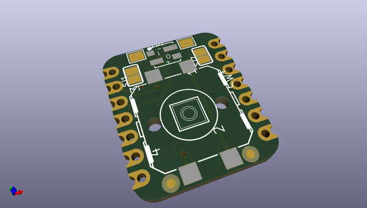
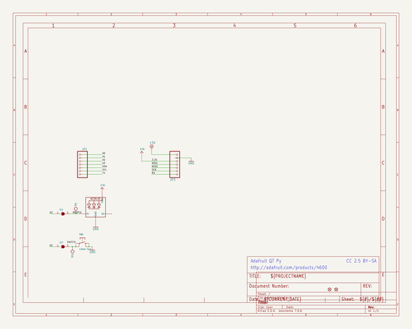
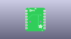
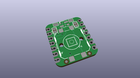
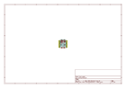
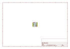
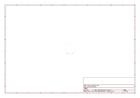
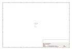

# OOMP Project  
## Adafruit-IoT-Button-with-NeoPixel-BFF-PCB  by adafruit  
  
oomp key: oomp_projects_flat_adafruit_adafruit_iot_button_with_neopixel_bff_pcb  
(snippet of original readme)  
  
-- Adafruit IoT Button with NeoPixel BFF PCB  
  
<a href="http://www.adafruit.com/products/5666">   
Click here to purchase one from the Adafruit shop</a>  
  
PCB files for the Adafruit IoT Button with NeoPixel BFF.   
  
Format is EagleCAD schematic and board layout  
* https://www.adafruit.com/product/5666  
  
--- Description  
  
Our QT Py boards are a great way to make very small microcontroller projects that pack a ton of power - and now we have a way for you to quickly add a chunky 12mm tactile button with a NeoPixel. It's an excellent way to create simple 'IoT Button' type projects with basic interactivity.  
  
We call this the Adafruit IoT Button with NeoPixel BFF - a "Best Friend Forever". When you were a kid you may have learned about the "buddy" system, well this product is kinda like that! A board that will watch your QT Py's back and give it more capabilities.  
  
This PCB is designed to fit onto the back of any QT Py or Xiao board, it can be soldered into place or use pin and socket headers to make it removable. Onboard is a 12mm tactile button with a nice large actuator, above is a 3.5mm RGB NeoPixel.  
  
We include some header that you can solder to your QT Py. You can also pick up an Itsy Bitsy short female header kit to make it removable but compact, you'll just need to trim down the headers to 7 pins long.  
  
Comes as an assembled and tested PCB  
For any QT Py or Xiao boards  
Tactile switch momentarily connects A2  to ground when pressed  
  full source readme at [readme_src.md](readme_src.md)  
  
source repo at: [https://github.com/adafruit/Adafruit-IoT-Button-with-NeoPixel-BFF-PCB](https://github.com/adafruit/Adafruit-IoT-Button-with-NeoPixel-BFF-PCB)  
## Board  
  
  
## Schematic  
  
  
  
[schematic pdf](working_schematic.pdf)  
## Images  
  
  
  
  
  
  
  
  
  
  
  
  
  
  
  
  
