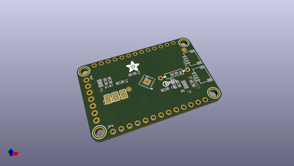
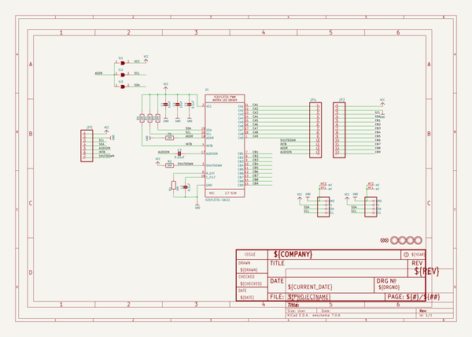
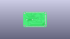
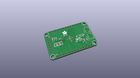
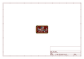
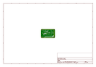
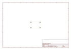
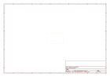
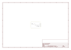

# OOMP Project  
## Adafruit-IS31FL3731-CharliePlex-LED-Breakout-PCB  by adafruit  
  
oomp key: oomp_projects_flat_adafruit_adafruit_is31fl3731_charlieplex_led_breakout_pcb  
(snippet of original readme)  
  
-- Adafruit IS31FL3731 CharliePlex LED Breakout PCB  
<a href="http://www.adafruit.com/products/2946">   
Click here to purchase one from the Adafruit shop</a>  
  
The IS31FL3731 will let you get back to that classic LED matrix look, with a nice upgrade! This I2C LED driver chip has the ability to PWM each individual LED in a 16x9 grid so you can have beautiful LED lighting effects, without a lot of pin twiddling. Simply tell the chip which LED on the grid you want lit, and what brightness and it's all taken care of for you.  
  
The IS31FL3731 is a nice little chip - it can use 2.7-5.5V power and logic so its flexible for use with any microcontroller. You can set the address so up to 4 matrices can share an I2C bus. Inside is enough RAM for 8 seperate frames of display memory so you can set up multiple frames of an animation and flip them to be displayed with a single command.  
  
This chip is great for making small LED displays, and we even designed the breakout to match up with our ready-to-go LED grids in red, yellow, green, blue and white. Sandwich the driver and matrix breakout, solder together for a compact setup. Or you can DIY your own setup, just follow the LED grid schematic in the IS31FL3731 datasheet.  
  
To get you going fast, we spun up a custom-made PCB in the STEMMA QT form factor, making it easy to interface with. The STEMMA QT connectors on either side are compatible with the SparkFun Qwiic I2C connectors. This allows  
  full source readme at [readme_src.md](readme_src.md)  
  
source repo at: [https://github.com/adafruit/Adafruit-IS31FL3731-CharliePlex-LED-Breakout-PCB](https://github.com/adafruit/Adafruit-IS31FL3731-CharliePlex-LED-Breakout-PCB)  
## Board  
  
  
## Schematic  
  
  
  
[schematic pdf](working_schematic.pdf)  
## Images  
  
  
  
  
  
  
  
  
  
  
  
  
  
  
  
  
