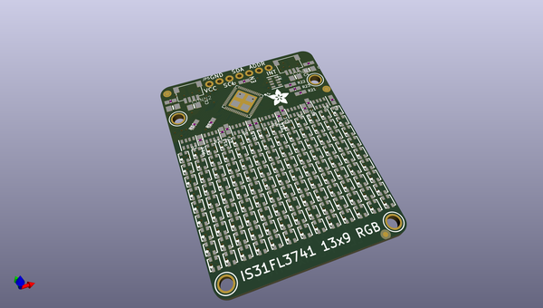
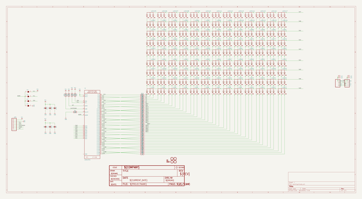
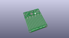
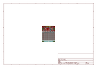
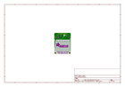
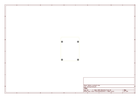
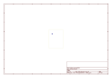
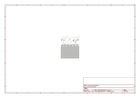

# OOMP Project  
## Adafruit-IS31FL3741-PCB  by adafruit  
  
oomp key: oomp_projects_flat_adafruit_adafruit_is31fl3741_pcb  
(snippet of original readme)  
  
-- Adafruit IS31FL3741 13x9 PWM RGB LED Matrix Driver PCB  
  
<a href="http://www.adafruit.com/products/5201">   
Click here to purchase one from the Adafruit shop</a>  
  
PCB files for the Adafruit IS31FL3741 13x9 PWM RGB LED Matrix Driver.   
  
Format is EagleCAD schematic and board layout  
* https://www.adafruit.com/product/5201  
  
--- Description  
  
Add a splash of RGB LEDs to a project you're working on, with this adorable 13x9 RGB LED matrix breakout. It features -- no surprise -- 117 RGB LEDs, each one 2x2mm in size, in a 13x9 grid with 3mm pitch spacing.  
  
Unlike our 8x8 dotstar grid here, these are not NeoPixel or DotStar or other 'smart' RGB LEDs. Instead of having a lil chip in each LED, there's one large controller chip that handles all the PWM for you. The ISSI IS32FL3741 communicates over I2C and can set each LED element with 8 bit PWM for 24-bit color across the RGB elements, for beautiful color! There's an adjustable current driver so you can brighten or dim the whole display without losing color resolution.  
  
Each assembled board comes with the grid, four mounting holes, and the IS31FL3741 chip with all supporting circuitry. The board can run from 3.3 to 5V DC power and logic - powering from 5V is recommended since the green and blue LEDs look better with the extra headroom. We designed the PCB so you can tile the boards side-to-side if you desire, you'll just have to cut/solder the jumpers on the bottom to change the I2C a  
  full source readme at [readme_src.md](readme_src.md)  
  
source repo at: [https://github.com/adafruit/Adafruit-IS31FL3741-PCB](https://github.com/adafruit/Adafruit-IS31FL3741-PCB)  
## Board  
  
  
## Schematic  
  
  
  
[schematic pdf](working_schematic.pdf)  
## Images  
  
  
  
  
  
  
  
  
  
  
  
  
  
  
  
  
