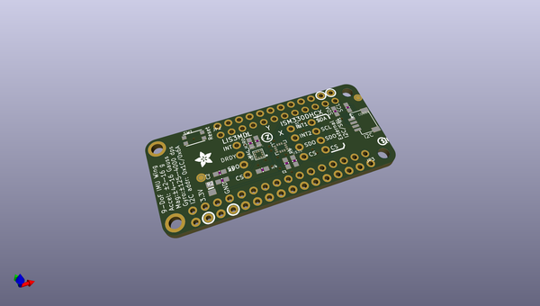
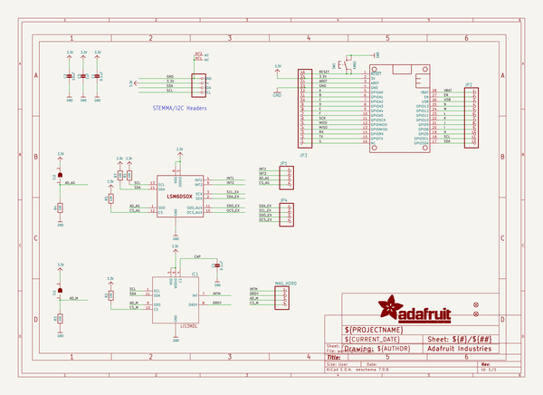
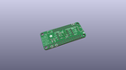
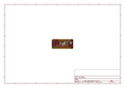
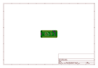
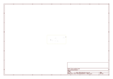
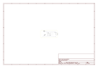

# OOMP Project  
## Adafruit-ISM330DHCX-LIS3MDL-FeatherWing-PCB  by adafruit  
  
(snippet of original readme)  
  
-- Adafruit ISM330DHCX + LIS3MDL FeatherWing - High Precision 9-DoF IMU PCB  
  
<a href="http://www.adafruit.com/products/4569">   
Click here to purchase one from the Adafruit shop</a>  
  
PCB files for the Adafruit ISM330DHCX + LIS3MDL FeatherWing - High Precision 9-DoF IMU.  
  
Format is EagleCAD schematic and board layout  
* https://www.adafruit.com/product/4569  
  
--- Description  
  
Upgrade any Feather board with precision motion sensing with the ST 9-DoF IMU, an all-in-one sensing 'Wing. It sports two fantastic sensors from ST to provide 9 degrees of full-motion data.  
  
The ST ISM330DHCX is an industrial quality Accelerometer+Gyroscope 6-DOF IMUs (inertial measurement unit). This IMU sensor has 6 degrees of freedom - 3 degrees each of linear acceleration and angular velocity at varying rates within a respectable range. For the accelerometer: ±2/±4/±8/±16 g at 1.6 Hz to 6.7KHz update rate. For the gyroscope: ±125/±250/±500/±1000/±2000/±4000 dps at 12.5 Hz to 6.7 KHz. In particular, this is one of the few gyro's we stock with 4000 dps range, usually they top out at 2000. This sensor has extra calibration and compensation circuits to give it excellent performance in a wide environmental range from -40 to +105°C. Most other IMU sensors don't have industrial temperature ranges or have wide accuracy variation as the temperature changes. The accelerometer and gyroscope also are on the same silicon die, which will keep the 6 measurements syn  
  full source readme at [readme_src.md](readme_src.md)  
  
source repo at: [https://github.com/adafruit/Adafruit-ISM330DHCX-LIS3MDL-FeatherWing-PCB](https://github.com/adafruit/Adafruit-ISM330DHCX-LIS3MDL-FeatherWing-PCB)  
## Board  
  
  
## Schematic  
  
  
  
[schematic pdf](working_schematic.pdf)  
## Images  
  
  
  
  
  
  
  
  
  
  
  
  
  
  
  
  
