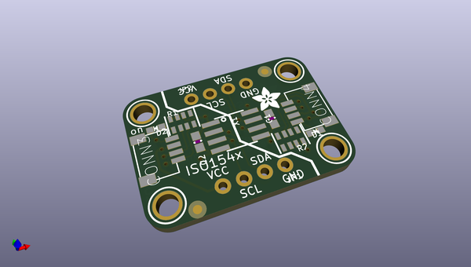
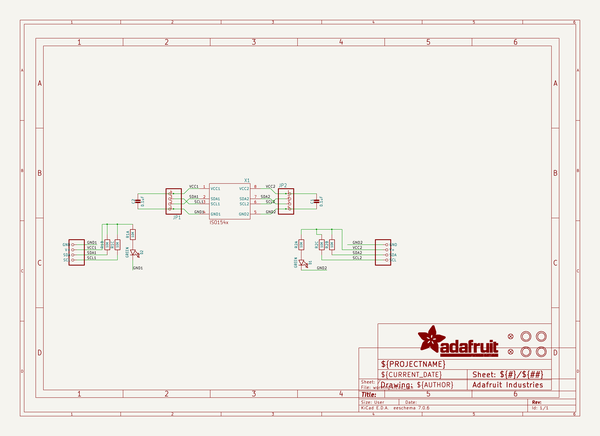
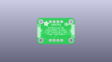
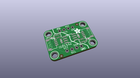
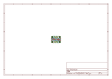
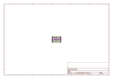
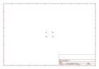
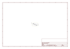

# OOMP Project  
## Adafruit-ISO1540-PCB  by adafruit  
  
(snippet of original readme)  
  
-- Adafruit ISO1540 Bidirectional I2C Isolator PCB  
  
<a href="http://www.adafruit.com/products/4903">   
Click here to purchase one from the Adafruit shop</a>  
  
PCB files for the Adafruit ISO1540 Bidirectional I2C Isolator.   
  
Format is EagleCAD schematic and board layout  
* https://www.adafruit.com/product/4903  
  
--- Description  
  
Sometimes you'll find yourself with an I2C bus controller on one side, and an I2C bus device on the other and you gotta keep em (electrically) separated. Maybe because one is Earth-grounded, maybe because you've got some funky power monitoring setup, maybe you want to reduce noise.  
  
Whatever it is, you can use the Adafruit ISO1540 Bidirectional I2C Isolator to add full electrical isolation between two sides of an I2C bus. The chip we use, the TI ISO1540 is fully bi-directional, supports up to 1 MHz clock rates, supports clock-stretching, works with 3 to 5V DC power or logic (separate on either side of course), with 2500 V-RMS isolation  
  
Usage is easy - you get power/ground/clock/data breakout pads for each side as well as a matching STEMMA QT connector. Unlike our other QT boards, the two sides are obviously electrically isolated, which means each half must be powered! Check that the green LED is lit on both sides. Now send data over I2C and you're good to go. We have 10K pullups on each side, from the I2C pins to the matching VCC for that side.  
  
For more details about chip specifications, check out the  
  full source readme at [readme_src.md](readme_src.md)  
  
source repo at: [https://github.com/adafruit/Adafruit-ISO1540-PCB](https://github.com/adafruit/Adafruit-ISO1540-PCB)  
## Board  
  
  
## Schematic  
  
  
  
[schematic pdf](working_schematic.pdf)  
## Images  
  
  
  
  
  
  
  
  
  
  
  
  
  
  
  
  
