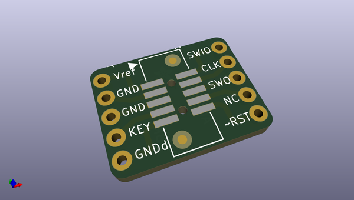
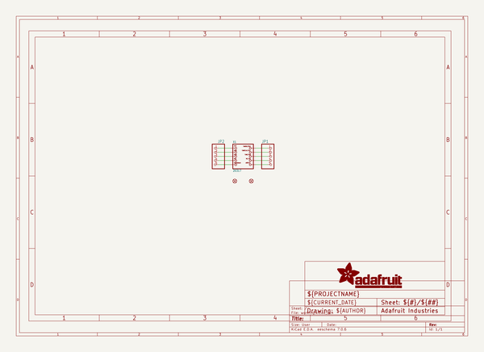
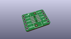
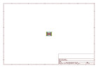
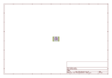
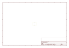
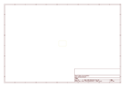
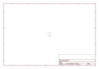

# OOMP Project  
## Adafruit-ISP-SWD-and-JTAG-Breakout-PCBs  by adafruit  
  
(snippet of original readme)  
  
-- Adafruit SWD and JTAG Breakout PCBs  
  
<a href="http://www.adafruit.com/products/1465">&nbsp;   
<a href="http://www.adafruit.com/products/2094">&nbsp;   
<a href="http://www.adafruit.com/products/2743">   
Click an image to purchase from the Adafruit shop</a>  
  
PCB files for the Adafruit ISP, SWD and JTAG Breakouts. Format is EagleCAD schematic and board layout  
  
For more details, check out the product pages at  
* https://www.adafruit.com/products/1465 (AVR ISP)  
* https://www.adafruit.com/products/2094 (JTAG to SWD)  
* https://www.adafruit.com/products/2743 (SWD breakout)  
  
--- Descriptions  
  
**AVR ISP:** It's rare to find a mini kit so elegant, it deserves its own Haiku. A simple breakout, 2x3 box header in the center, two 1x3's on the side. Plugs into any breadboard for neat wiring (in both nifty and clean senses of the word).  
  
Comes with a quality mini PCB, a 2x3 box header and a small stick of 0.1" header. Requires some light soldering to use: plug the 2x3 in on the top and solder all six pins, then break the header in half and put each half into a breadboard to hold them steady. Place the breakout on top and solder the side pins. Will last you years and years.  
  
**JTAG to SWD:** This adapter board is designed for adapting a 'classic' 2x10 (0.1"/2.54mm pitch) JTAG cable to a slimmer 2x5 (0.05"/1.27mm pitch) SWD Cable.  It's helpful  
  full source readme at [readme_src.md](readme_src.md)  
  
source repo at: [https://github.com/adafruit/Adafruit-ISP-SWD-and-JTAG-Breakout-PCBs](https://github.com/adafruit/Adafruit-ISP-SWD-and-JTAG-Breakout-PCBs)  
## Board  
  
  
## Schematic  
  
  
  
[schematic pdf](working_schematic.pdf)  
## Images  
  
  
  
  
  
  
  
  
  
  
  
  
  
  
  
  
