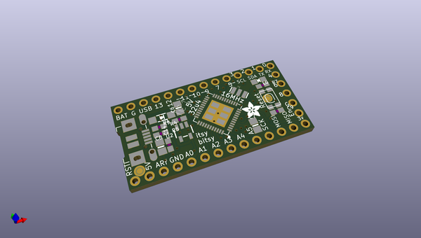
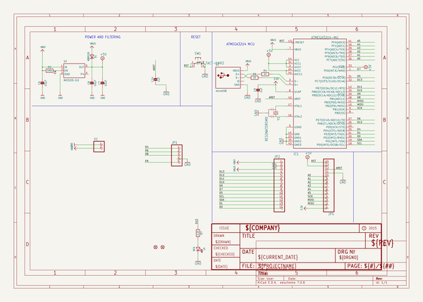
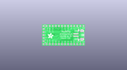
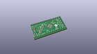
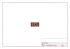
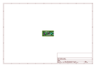
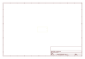
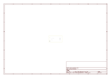
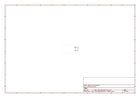
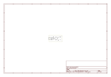

# OOMP Project  
## Adafruit-ItsyBitsy-32u4-PCB  by adafruit  
  
oomp key: oomp_projects_flat_adafruit_adafruit_itsybitsy_32u4_pcb  
(snippet of original readme)  
  
-- Adafruit ItsyBitsy 32u4 PCB  
  
<a href="http://www.adafruit.com/products/3677">&nbsp;   
<a href="http://www.adafruit.com/products/3675">   
Click picture or links below to purchase one from the Adafruit shop</a>  
  
PCB CAD files for the Adafruit ItsyBitsy 32u4. PCB format is EagleCAD schematic and board layout  
  
For more details, check out the product pages at  
* ItsyBitsy 32u4 - 5V 16MHz https://www.adafruit.com/products/3677  
* ItsyBitsy 32u4 - 3V 8MHz https://www.adafruit.com/products/3675  
  
--- Description  
  
What's smaller than a Feather but larger than a Trinket? It's an ItsyBitsy! Small, powerful, Arduino-compatible - this microcontroller board is perfect when you want something very compact, but still with a bunch of pins.  
  
ItsyBitsy is only 1.4" long by 0.7" wide, but has 6 power pins, 6 analog & digital pins and 17 digital pins. It packs much of the same capability as an Arduino UNO. So it's great once you've finished up a prototype on a bigger Arduino, and want to make the project much smaller.  
  
The ItsyBitsy 32u4 5V 16MHz and 3V 8MHz use the Atmega32u4 chip, which is the same core chip in the Arduino Leonardo as well as the same chip we use in our Feather 32u4. You'll be happy to hear that not only is ItsyBitsy programmable using the Arduino IDE as you already have set up, but a vast number of Arduino projects will work out of the box!  
  
We recommend this as an upgrade fro  
  full source readme at [readme_src.md](readme_src.md)  
  
source repo at: [https://github.com/adafruit/Adafruit-ItsyBitsy-32u4-PCB](https://github.com/adafruit/Adafruit-ItsyBitsy-32u4-PCB)  
## Board  
  
  
## Schematic  
  
  
  
[schematic pdf](working_schematic.pdf)  
## Images  
  
  
  
  
  
  
  
  
  
  
  
  
  
  
  
  
