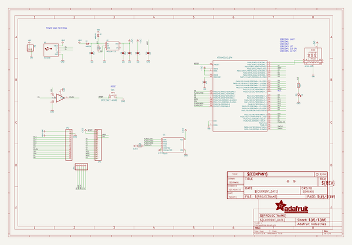

# OOMP Project  
## Adafruit-ItsyBitsy-M0-PCB  by adafruit  
  
(snippet of original readme)  
  
-- Adafruit ItsyBitsy M0 microcontroller breakout PCB  
  
<a href="http://www.adafruit.com/products/3727">   
Click here to purchase one from the Adafruit shop</a>  
  
PCB files for the Adafruit ItsyBitsy M0. PCB format is EagleCAD schematic and board layout  
  
For more details, check out the product pages at  
* https://www.adafruit.com/products/3727  
  
--- Description  
  
What's smaller than a Feather but larger than a Trinket? It's an Adafruit ItsyBitsy M0 Express! Small, powerful, with a rockin' ATSAMD21 Cortex M0 processor running at 48 MHz - this microcontroller board is perfect when you want something very compact, but still with a bunch of pins.  
  
ItsyBitsy M0 Express is only 1.4" long by 0.7" wide, but has 6 power pins, 23 digital GPIO pins (12 of which can be analog in, 1x analog out, and 13x PWM out). It's the same chip as the Arduino Zero and packs much of the same capability as an Adafruit Metro M0 Express or Feather M0 Express but really really small. So it's great once you've finished up a prototype on a Metro M0 or Feather M0, and want to make the project much smaller. It even comes with 2MB of SPI Flash built in, for data logging, file storage, or CircuitPython code.  
  
The most exciting part of the ItsyBitsy M0 is that while you can use it with the Arduino IDE, we are shipping it with CircuitPython on board. When you plug it in, it will show up as a very small disk drive with main.py on it. Edit main.py with your favorite t  
  full source readme at [readme_src.md](readme_src.md)  
  
source repo at: [https://github.com/adafruit/Adafruit-ItsyBitsy-M0-PCB](https://github.com/adafruit/Adafruit-ItsyBitsy-M0-PCB)  
## Board  
  
  
## Schematic  
  
  
  
[schematic pdf](working_schematic.pdf)  
## Images  
  
  
  
  
  
  
  
  
  
  
  
  
  
  
  
  
