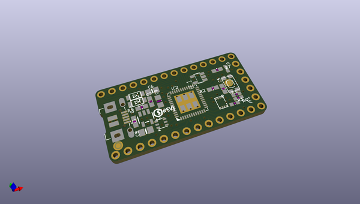
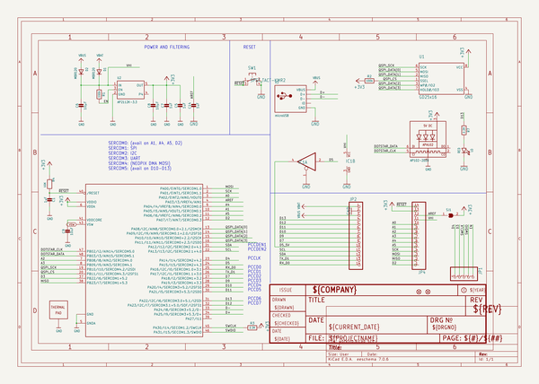
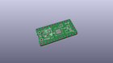
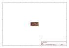
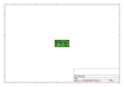
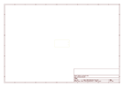
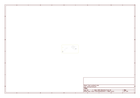
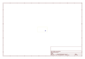
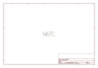

# OOMP Project  
## Adafruit-ItsyBitsy-M4-Express-PCB  by adafruit  
  
(snippet of original readme)  
  
-- Adafruit ItsyBitsy M4 Express PCB  
  
<a href="http://www.adafruit.com/products/3800">   
Click here to purchase one from the Adafruit shop</a>  
  
PCB files for the Adafruit ItsyBitsy M4 Express. PCB format is EagleCAD schematic and board layout  
  
For more details, check out the product pages at  
* https://www.adafruit.com/products/3800  
  
--- Description  
  
What's smaller than a Feather but larger than a Trinket? It's an Adafruit ItsyBitsy M4 Express featuring the Microchip ATSAMD51! Small, powerful, with a ultra fast ATSAMD51 Cortex M4 processor running at 120 MHz - this microcontroller board is perfect when you want something very compact, with a ton of horsepower and a bunch of pins. This Itsy is like a bullet train, with it's 120MHz Cortex M4 with floating point support and 512KB Flash and 192KB RAM. Your code will zig and zag and zoom, and with a bunch of extra peripherals for support, this will for sure be your favorite new chipset.  
  
ItsyBitsy M4 Express is only 1.4" long by 0.7" wide, but has 6 power pins, 23 digital GPIO pins (7 of which can be analog in, 2 x 1 MSPS analog out DACs, and 18 x PWM out). It's the same chip as the Adafruit Metro M4 but really really small. So it's great once you've finished up a prototype on a Metro M4 or (the upcoming) Feather M4, and want to make the project much smaller. It even comes with 2MB of SPI Flash built in, for data logging, file storage, or CircuitPython code.  
  
The most exciting p  
  full source readme at [readme_src.md](readme_src.md)  
  
source repo at: [https://github.com/adafruit/Adafruit-ItsyBitsy-M4-Express-PCB](https://github.com/adafruit/Adafruit-ItsyBitsy-M4-Express-PCB)  
## Board  
  
  
## Schematic  
  
  
  
[schematic pdf](working_schematic.pdf)  
## Images  
  
  
  
  
  
  
  
  
  
  
  
  
  
  
  
  
