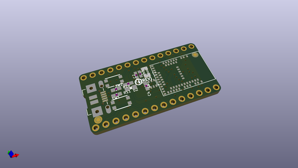
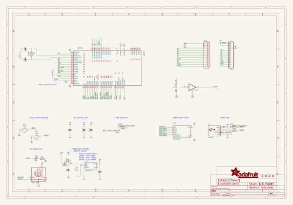
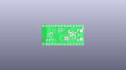
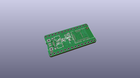
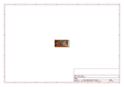
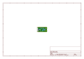
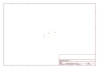
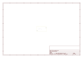
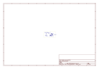
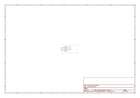

# OOMP Project  
## Adafruit-ItsyBitsy-nRF52840-Express-PCB  by adafruit  
  
oomp key: oomp_projects_flat_adafruit_adafruit_itsybitsy_nrf52840_express_pcb  
(snippet of original readme)  
  
-- Adafruit ItsyBitsy nRF52840 Express PCB  
  
<a href="http://www.adafruit.com/products/4481">   
Click here to purchase one from the Adafruit shop</a>  
  
PCB files for the Adafruit ItsyBitsy nRF52840 Express.   
  
Format is EagleCAD schematic and board layout  
* https://www.adafruit.com/product/4481  
  
--- Description  
  
What's smaller than a Feather but larger than a Trinket? It's an Adafruit ItsyBitsy nRF52840 Express featuring the Nordic nRF52840 Bluetooth LE processor! Teensy & powerful, with an fast nRF52840 Cortex M4 processor running at 64 MHz and 1 MB of FLASH - this microcontroller board is perfect when you want something very compact, with a heap-load of memory and Bluetooth LE support This Itsy is your best option for tiny wireless connectivity - it can act as both a BLE central and peripheral, with support in both Arduino and CircuitPython  
  
ItsyBitsy nRF52840 Express is only 1.4" long by 0.7" wide, but has 6 power pins, 21 digital GPIO pins (6 of which can be analog in). It's the same chip as the Feather nRF52840 but really really small. So it's great for thse really compact builds. It even comes with 2MB of QSPI Flash built in, for data logging, file storage, or CircuitPython code.  
  
The most exciting part of the ItsyBitsy is that while we ship it with an Arduino IDE compatible demo, you can also install CircuitPython on board with only a few clicks. When you plug it in, it will show up as a very small disk drive with code.  
  full source readme at [readme_src.md](readme_src.md)  
  
source repo at: [https://github.com/adafruit/Adafruit-ItsyBitsy-nRF52840-Express-PCB](https://github.com/adafruit/Adafruit-ItsyBitsy-nRF52840-Express-PCB)  
## Board  
  
  
## Schematic  
  
  
  
[schematic pdf](working_schematic.pdf)  
## Images  
  
  
  
  
  
  
  
  
  
  
  
  
  
  
  
  
