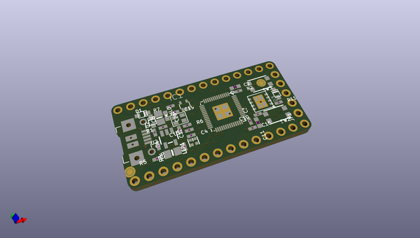
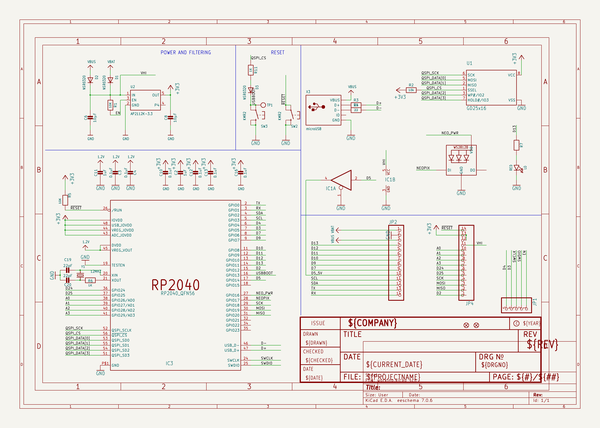
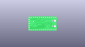
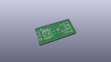
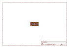
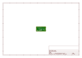
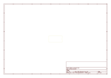
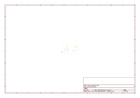
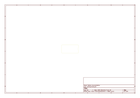
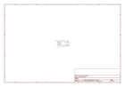

# OOMP Project  
## Adafruit-ItsyBitsy-RP2040-PCB  by adafruit  
  
(snippet of original readme)  
  
-- Adafruit ItsyBitsy RP2040 PCB  
  
<a href="http://www.adafruit.com/products/4888">   
Click here to purchase one from the Adafruit shop</a>  
  
PCB files for the Adafruit ItsyBitsy RP2040.  
  
Format is EagleCAD schematic and board layout  
* https://www.adafruit.com/product/4888  
  
--- Description  
  
A new chip means a new ItsyBitsy, and the Raspberry Pi RP2040 is no exception. When we saw this chip we thought "this chip is going to be awesome when we give it the ItsyBitsy teensy-weensy Treatment" and so we did! This Itsy' features the RP2040, and all niceties you know and love about the ItsyBitsy family.  
  
What's smaller than a Feather but larger than a Trinket? It's an Adafruit ItsyBitsy RP2040 featuring the Raspberry Pi RP2040! Small, powerful, with a ultra fast dual Cortex M0+ processor running at 125 MHz - this microcontroller board is perfect when you want something very compact, with lots of horsepower and a bunch of pins. This Itsy has sports car speed, but SUV roominess with 8 MB of FLASH and 264KB of SRAM.  
  
ItsyBitsy RP2040 is only 1.4" long by 0.7" wide, but has 6 power pins, 23 digital GPIO pins (4 of which can be analog in and 16 x PWM out). It's the same chip as the Feather RP2040 and Raspberry Pi Pico but really really small. So it's great once you've finished up a prototype, and want to make the project much smaller. It even comes with 8 MB of SPI Flash built in, for data logging, file storage, or CircuitPython/MicroPyth  
  full source readme at [readme_src.md](readme_src.md)  
  
source repo at: [https://github.com/adafruit/Adafruit-ItsyBitsy-RP2040-PCB](https://github.com/adafruit/Adafruit-ItsyBitsy-RP2040-PCB)  
## Board  
  
  
## Schematic  
  
  
  
[schematic pdf](working_schematic.pdf)  
## Images  
  
  
  
  
  
  
  
  
  
  
  
  
  
  
  
  
