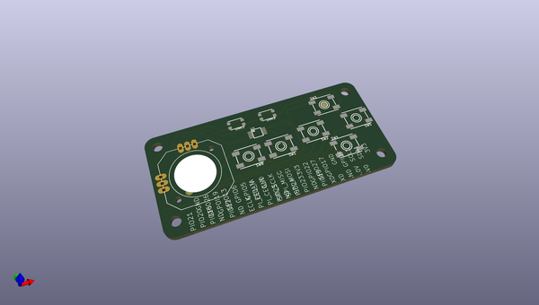
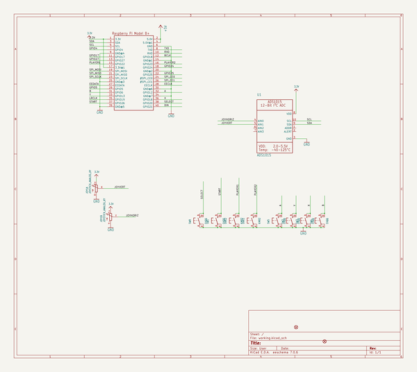
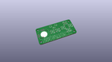
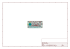
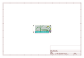
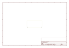
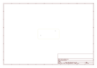
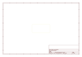
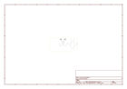

# OOMP Project  
## Adafruit-Joy-Bonnet-PCB  by adafruit  
  
oomp key: oomp_projects_flat_adafruit_adafruit_joy_bonnet_pcb  
(snippet of original readme)  
  
-- Adafruit Joy Bonnet PCB  
  
<a href="http://www.adafruit.com/products/3464">   
Click here to purchase one from the Adafruit shop</a>  
  
PCB files for the Adafruit Joy Bonnet for Raspberry Pi. Format is EagleCAD schematic and board layout  
* http://www.adafruit.com/product/3464  
  
--- Description  
  
Pocket-sized fun is the name of this game, with the Joy Bonnet – our most fun Bonnet ever (no we didn't even think that was possible, either!). This Bonnet fits perfectly on top of your Raspberry Pi Zero (any kind) and gives you adorable hand-held arcade controls. Once you install our script onto your Pi, the controls will act like a keyboard, for easy use with any emulator or media player.  
  
Personally, we found this Bonnet to work best with RetroPie/EmulationStation. On a Pi Zero we could emulate NES and MAME game (our favorites!) but other emulators that don't require more than 1GHz speeds will work OK too, e.g. a N64 emulator won't work, it needs way more power!  
  
Best of all, this Bonnet is fully assembled - no soldering at all is required. You may need to solder headers onto your Pi Zero (or use press-fit headers) but once that's done you're ready to rock. In theory you could also use this with a Pi A+ or B+/2/3 but it wouldn't be very hand-held.  
  
--- License  
  
Adafruit invests time and resources providing this open source design, please support Adafruit and open-source hardware by purchasing products from [Adafruit](https://www.ada  
  full source readme at [readme_src.md](readme_src.md)  
  
source repo at: [https://github.com/adafruit/Adafruit-Joy-Bonnet-PCB](https://github.com/adafruit/Adafruit-Joy-Bonnet-PCB)  
## Board  
  
  
## Schematic  
  
  
  
[schematic pdf](working_schematic.pdf)  
## Images  
  
  
  
  
  
  
  
  
  
  
  
  
  
  
  
  
