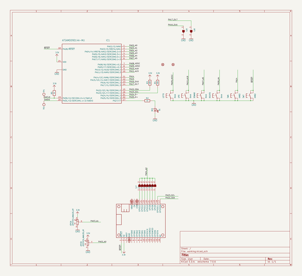

# OOMP Project  
## Adafruit-Joy-Featherwing-PCB  by adafruit  
  
(snippet of original readme)  
  
-- Adafruit Joy FeatherWing PCB  
  
<a href="http://www.adafruit.com/products/3632">   
Click here to purchase one from the Adafruit shop</a>  
  
PCB files for joy featherwing. Format is EagleCAD schematic and board layout  
  
For more details, check out the product page at  
* https://www.adafruit.com/products/3632  
  
--- Description  
  
Make a game or robotic controller with this Joy-ful FeatherWing. This FeatherWing has a 2-axis joystick and 5 momentary buttons (4 large and 1 small) so you can turn your feather board into a tiny game controller. This wing communicates with your host microcontroller over I2C so it's easy to use and doesn't take up any of your precious analog or digital pins. There is also an optional interrupt pin that can alert your feather when a button has been pressed or released to free up processor time for other tasks.  
  
This FeatherWing features Adafruit Seesaw technology - a custom programmed little helper microcontroller that takes the two analog inputs from the joystick, and 5 button inputs, and converts it into a pretty I2C interface. This I2C interface means you don't 'lose' any GPIO or analog inputs when using this 'Wing, and it works with any and all Feathers! You can easily stack this with any other FeatherWing because I2C is a shared bus. If you have an I2C address conflict, or you want to connect more than one of these to a Feather, there are two address-select jumpers so you have 4 options of I2C addres  
  full source readme at [readme_src.md](readme_src.md)  
  
source repo at: [https://github.com/adafruit/Adafruit-Joy-Featherwing-PCB](https://github.com/adafruit/Adafruit-Joy-Featherwing-PCB)  
## Board  
  
  
## Schematic  
  
  
  
[schematic pdf](working_schematic.pdf)  
## Images  
  
  
  
  
  
  
  
  
  
  
  
  
  
  
  
  
