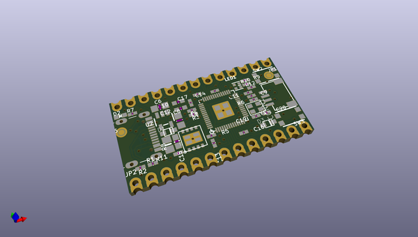
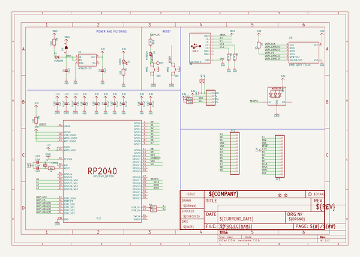
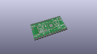
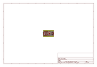
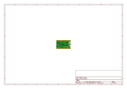
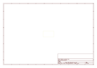
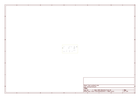
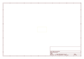
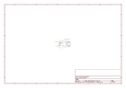

# OOMP Project  
## Adafruit-KB2040-PCB  by adafruit  
  
oomp key: oomp_projects_flat_adafruit_adafruit_kb2040_pcb  
(snippet of original readme)  
  
-- Adafruit KB2040 - RP2040 Kee Boar Driver PCB  
  
<a href="http://www.adafruit.com/products/5302">   
Click here to purchase one from the Adafruit shop</a>  
  
PCB files for the Adafruit KB2040 - RP2040 Kee Boar Driver.   
  
Format is EagleCAD schematic and board layout  
* https://www.adafruit.com/product/5302  
  
--- Description  
  
A wild Kee Boar appears! It’s a shiny KB2040! An Arduino Pro Micro-shaped board for Keebs with RP2040. (-keeblife 4 evah) A lot of folks like using Adafruit parts for their Keeb builds – but with the ItsyBitsy not being pin-compatible with the Pro Micro pinout, it really wasn't very easy without some sort of adapter plate.  
  
Now we’re seeing lots of people use CircuitPython for keebs, which is awesome! So why not try our hands at spinning up a pro-micro-compatible RP2040 board? The RP2040 is plenty powerful, low-cost, and makes for an excellent keeb driver chip.  
  
We mixed together what we liked most about the SparkFun Pro Micro RP2040 (Qwiic / STEMMA QT I2C port on the end, so good!) and Elite-C (castellated pads & pins for D+ and D-) and our existing RP2040 boards (boot button can be used for user, 8MB QSPI flash, onboard NeoPixel, jumper for skipping the diode/fuse for high power RGB LEDs or USB hosting). We even got it to all fit on a 2-layer PCB with 7/7 routing – just needed to make the smallest caps and resistors 0402.   
  
With 20 GPIO available (18 on castellated pins, 2 on STEMMA QT port) you can easily   
  full source readme at [readme_src.md](readme_src.md)  
  
source repo at: [https://github.com/adafruit/Adafruit-KB2040-PCB](https://github.com/adafruit/Adafruit-KB2040-PCB)  
## Board  
  
  
## Schematic  
  
  
  
[schematic pdf](working_schematic.pdf)  
## Images  
  
  
  
  
  
  
  
  
  
  
  
  
  
  
  
  
