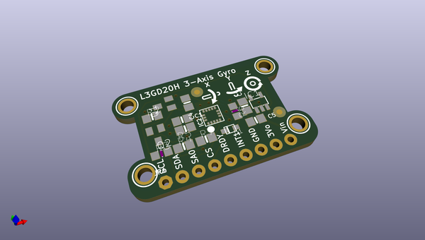
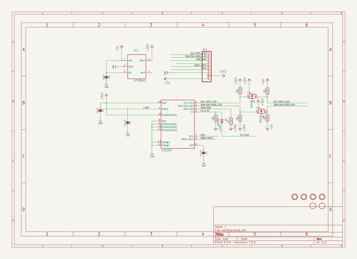
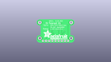
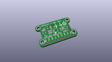
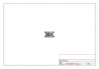
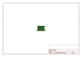
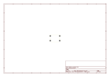
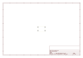
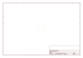
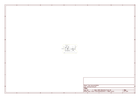

# OOMP Project  
## Adafruit-L3GD20-Breakout-PCB  by adafruit  
  
oomp key: oomp_projects_flat_adafruit_adafruit_l3gd20_breakout_pcb  
(snippet of original readme)  
  
-- Adafruit L3GD20H Triple-Axis Gyro Breakout Board PCB  
<a href="http://www.adafruit.com/products/1032">   
Click here to purchase one from the Adafruit shop</a>  
  
A gyroscope is a type of sensor that can sense twisting and turning motions. Often paired with an accelerometer, you can use these to do 3D motion capture and inertial measurement (that is - you can tell how an object is moving!) As these sensors become more popular and easier to manufacture, the prices for them have dropped to the point where you can easily afford a triple-axis gyro! Only a decade ago, this space-tech sensor would have been hundreds of dollars.  
  
This breakout board is based around the latest gyro technology, the L3GD20H from STMicro. It's the upgrade to the L3G4200 (see this app note on what to look for if upgrading an existing design to the L3GD20) with three full axes of sensing. The chip can be set to ±250, ±500, or ±2000 degree-per-second scale for a large range of sensitivity. There's also built in high and low pass sensing to make data processing easier. The chip supports both I2C and SPI so you can interface with any microcontroller easily.  
  
PCB files for the Adafruit L3GD20 Breakout. The format is EagleCAD schematic and board layout  
- https://www.adafruit.com/product/1032  
  
--- License  
  
Adafruit invests time and resources providing this open source design, please support Adafruit and open-source hardware by purchasing products from [Adafru  
  full source readme at [readme_src.md](readme_src.md)  
  
source repo at: [https://github.com/adafruit/Adafruit-L3GD20-Breakout-PCB](https://github.com/adafruit/Adafruit-L3GD20-Breakout-PCB)  
## Board  
  
  
## Schematic  
  
  
  
[schematic pdf](working_schematic.pdf)  
## Images  
  
  
  
  
  
  
  
  
  
  
  
  
  
  
  
  
