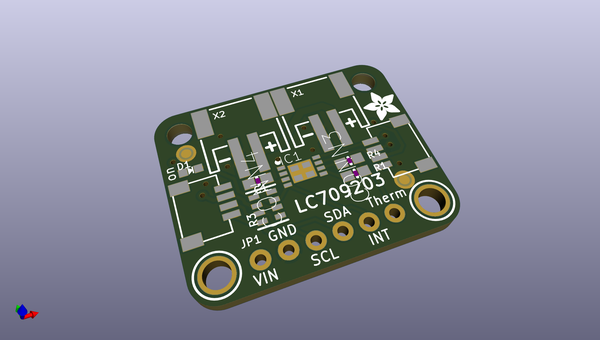
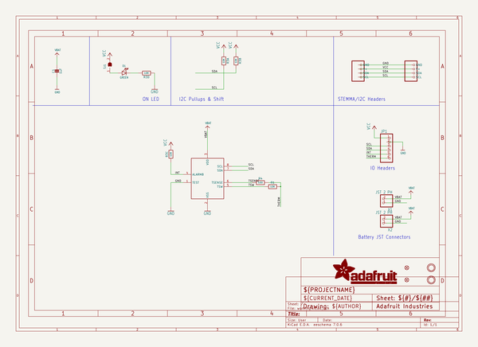
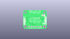
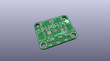
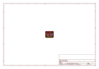
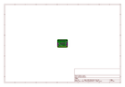
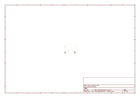
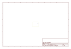
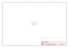

# OOMP Project  
## Adafruit-LC709203F-PCB  by adafruit  
  
(snippet of original readme)  
  
-- Adafruit LC709203F LiPoly / LiIon Fuel Gauge and Battery Monitor PCB  
  
<a href="http://www.adafruit.com/products/4712">   
Click here to purchase one from the Adafruit shop</a>  
  
PCB files for the Adafruit LC709203F LiPoly / LiIon Fuel Gauge and Battery Monitor.  
  
Format is EagleCAD schematic and board layout  
* https://www.adafruit.com/product/4712  
  
--- Description  
  
Low cost Lithium Polymer batteries have revolutionized electronics - they're thin, they're light, they can be regulated down to 3.3V and they're easy to charge. On your phone, there's a little image of a battery cell that tells you the percentage of charge - so you know when you absolutely need to plug it in and when you can stay untethered. The Adafruit LC709203F LiPoly / LiIon Fuel Gauge and Battery Monitor does the same thing. Connect it to your Lipoly or LiIon battery and it will let you know the voltage of the cell, it does the annoying math of decoding the non-linear voltage to get you a valid percentage as well!  
  
Since this nice chip is I2C, it works with any and all microcontroller or microcomputer boards, from the Arduino UNO up to the Raspberry Pi. And you don't have to worry about logic level, as the gauge runs with 3.3V or 5.0V power and logic equally fine.  
  
To use, connect the single-cell battery to one of the JST 2 PH ports (either one). Then use the included JST PH jumper cable to connect to your boost converter, Feather, whatever! Use the I2C inte  
  full source readme at [readme_src.md](readme_src.md)  
  
source repo at: [https://github.com/adafruit/Adafruit-LC709203F-PCB](https://github.com/adafruit/Adafruit-LC709203F-PCB)  
## Board  
  
  
## Schematic  
  
  
  
[schematic pdf](working_schematic.pdf)  
## Images  
  
  
  
  
  
  
  
  
  
  
  
  
  
  
  
  
