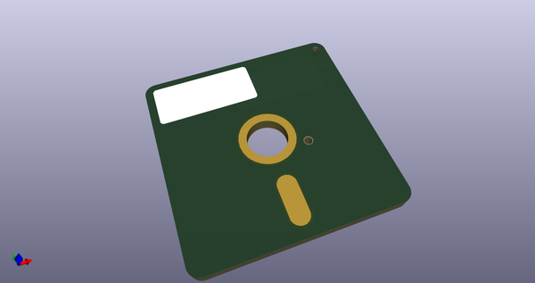

# OOMP Project  
## Adafruit_Learning_System_Guides  by adafruit  
  
oomp key: oomp_projects_flat_adafruit_adafruit_learning_system_guides  
(snippet of original readme)  
  
[](https://travis-ci.com/adafruit/Adafruit_Learning_System_Guides)  
- Introduction  
  
This is a collection of smaller programs and scripts to display "inline" in  
[Adafruit Learning System][learn] guides.  Subdirectories here will generally  
contain a README with a link to their corresponding guide.  
  
-- Testing  
  
The code here is partially checked by GitHub Actions against Pylint (for  
CircuitPython code) or the Arduino compilation process.  
  
Code in directories containing a file called `.circuitpython.skip` will be  
skipped by Pylint checks.  
  
Code in directories containing a `.[platformname].test` file, such as  
`.uno.test` will be compiled against the corresponding platform.  
  
This is a work in progress.  
  
[learn]: https://learn.adafruit.com/  
  
-- Running pylint locally  
Install a specific version of pylint under the name "pylint-learn":  
```  
pip install pipx  
pipx install --suffix=-learn pylint==2.7.1  
```  
Then use the `pylint_check` script to run pylint on the files or directories  
of your choice (note that your terminal *must* be in the top directory of  
Adafruit_Learning_System_Guides, not a sub-directory):  
```  
./pylint_check CircuitPython_Cool_Project  
```  
  
  full source readme at [readme_src.md](readme_src.md)  
  
source repo at: [https://github.com/adafruit/Adafruit_Learning_System_Guides](https://github.com/adafruit/Adafruit_Learning_System_Guides)  
## Board  
  
[](working_3d.png)  
## Schematic  
  
[](working_schematic.png)  
  
[schematic pdf](working_schematic.pdf)  
## Images  
  
[](working_3d.png)  
  
[](working_3d_back.png)  
  
[](working_3d_front.png)  
