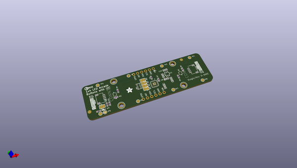
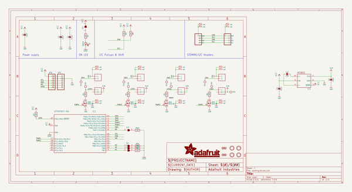
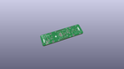
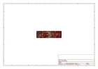
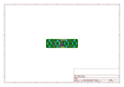
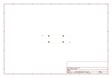
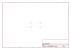
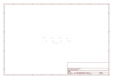
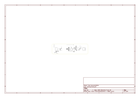
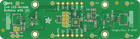

# OOMP Project  
## Adafruit-LED-Arcade-Button-1x4-PCB  by adafruit  
  
(snippet of original readme)  
  
-- Adafruit LED Arcade Button 1x4 - STEMMA QT I2C Breakout PCB  
  
<a href="http://www.adafruit.com/products/5296">   
Click here to purchase one from the Adafruit shop</a>  
  
PCB files for the Adafruit LED Arcade Button 1x4 - STEMMA QT I2C Breakout  
  
Format is EagleCAD schematic and board layout  
* https://www.adafruit.com/product/5296  
  
--- Description  
  
The only thing better than a glowy arcade button is, perhaps, FOUR glowing arcade buttons - and that's what the Adafruit LED Arcade Button 1x4 QT I2C Breakout will let you do! This long 3" x 0.8" PCB has 8 x JST XH sockets that will fit our arcade button quick connects. Each XH pair lets you connect one arcade button that has a built in LED illuminator, and makes it easy to use with a breadboard/perfboard or with a STEMMA QT (Qwiic) connector for instant I2C connectivity on any platform.  
  
--- License  
  
Adafruit invests time and resources providing this open source design, please support Adafruit and open-source hardware by purchasing products from [Adafruit](https://www.adafruit.com)!  
  
Designed by Limor Fried/Ladyada for Adafruit Industries.  
  
Creative Commons Attribution/Share-Alike, all text above must be included in any redistribution.   
See license.txt for additional details.  
  
  full source readme at [readme_src.md](readme_src.md)  
  
source repo at: [https://github.com/adafruit/Adafruit-LED-Arcade-Button-1x4-PCB](https://github.com/adafruit/Adafruit-LED-Arcade-Button-1x4-PCB)  
## Board  
  
  
## Schematic  
  
  
  
[schematic pdf](working_schematic.pdf)  
## Images  
  
  
  
  
  
  
  
  
  
  
  
  
  
  
  
  
  
  
