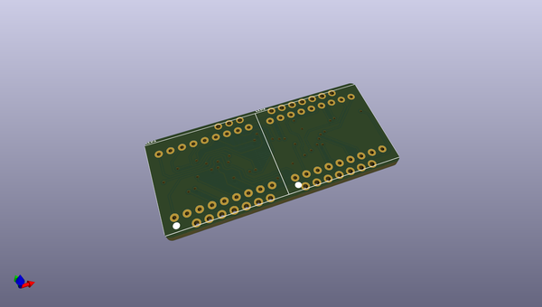
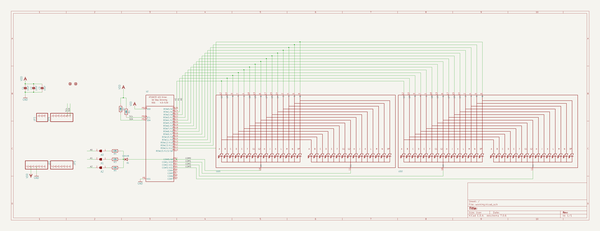
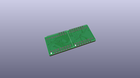
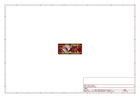
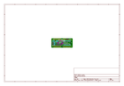
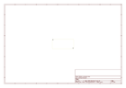
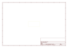
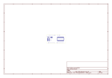
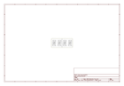

# OOMP Project  
## Adafruit-LED-Backpack-FeatherWing-PCB  by adafruit  
  
oomp key: oomp_projects_flat_adafruit_adafruit_led_backpack_featherwing_pcb  
(snippet of original readme)  
  
-- Adafruit LED Backpack FeatherWing PCB  
&nbsp;    
Click to purchase from the Adafruit Shop:  
- [Adafruit 4-Digit 7-Segment LED Matrix Display FeatherWing](https://www.adafruit.com/product/3088)  
- [Adafruit 14-Segment Alphanumeric LED FeatherWing](https://www.adafruit.com/product/3089)  
  
These are the Eagle CAD files for the Adafruit LED FeatherWings Backpack breakouts:  
  
--- 7-segment  
  
This is the Adafruit 4-Digit 7-Segment LED Matrix Display FeatherWing! This 7-segment FeatherWing backpack makes it really easy to add a 4-digit numeric display with decimal points and even 'second colon dots' for making a clock.  
  
This version does not come with an LED matrix. Its also available in combo packs of Blue, Green, Red, White, or Yellow which we recommend since you'll know you have a working LED matrix. Not guaranteed to work with any other 7-segment modules.  
  
- http://www.adafruit.com/products/3088  
- http://www.adafruit.com/products/3106  
- http://www.adafruit.com/products/3107  
- http://www.adafruit.com/products/3108  
- http://www.adafruit.com/products/3109  
- http://www.adafruit.com/products/3110  
  
--- 14-segment  
  
This is the Adafruit 0.56" 4-Digit 14-Segment Display FeatherWing! This 14-segment FeatherWing backpack makes it really easy to add a bright alphanumeric display that shows  
  full source readme at [readme_src.md](readme_src.md)  
  
source repo at: [https://github.com/adafruit/Adafruit-LED-Backpack-FeatherWing-PCB](https://github.com/adafruit/Adafruit-LED-Backpack-FeatherWing-PCB)  
## Board  
  
  
## Schematic  
  
  
  
[schematic pdf](working_schematic.pdf)  
## Images  
  
  
  
  
  
  
  
  
  
  
  
  
  
  
  
  
