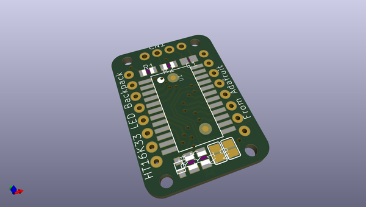
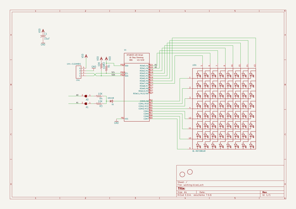
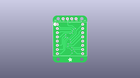
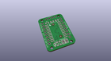
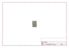
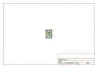
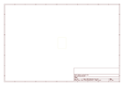
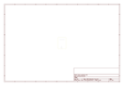
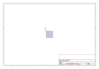
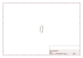

# OOMP Project  
## Adafruit-LED-Backpacks  by adafruit  
  
(snippet of original readme)  
  
- Adafruit LED Matrix backpacks PCBs  
  
&nbsp;   
&nbsp;   
&nbsp;   
   
&nbsp;   
&nbsp;   
&nbsp;   
   
  
What's better than a single LED? Lots of LEDs! A fun way to make a small display is to use an 8x8 matrix or a 4-digit 7-segment display. Matrices like these are 'multiplexed' - so to control all the seven-segment LEDs you need 14 pins. That's a lot of pins, and there are driver chips like the MAX7219 that can control a matrix for you but there's a lot of wiring to set up and they take up a ton of space. Here at Adafruit we feel your pain! After all, wouldn't it be awesome if you could control a matrix without tons of wiring? That's where these adorable LED matrix backpacks come in. We have  
  full source readme at [readme_src.md](readme_src.md)  
  
source repo at: [https://github.com/adafruit/Adafruit-LED-Backpacks](https://github.com/adafruit/Adafruit-LED-Backpacks)  
## Board  
  
  
## Schematic  
  
  
  
[schematic pdf](working_schematic.pdf)  
## Images  
  
  
  
  
  
  
  
  
  
  
  
  
  
  
  
  
