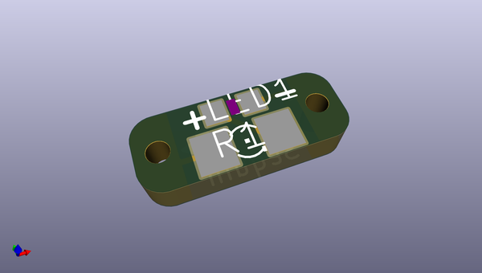
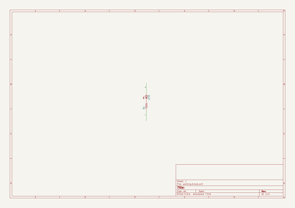
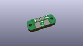
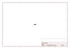
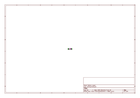
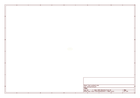
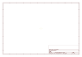

# OOMP Project  
## Adafruit-LED-Sequin-PCB  by adafruit  
  
oomp key: oomp_projects_flat_adafruit_adafruit_led_sequin_pcb  
(snippet of original readme)  
  
-- Adafruit LED Sequin PCB  
<a href="http://www.adafruit.com/products/1755">   
Click here to purchase one from the Adafruit shop</a>  
  
Sew a little sparkle into your wearable project with an Adafruit LED Sequin. These are the kid-sister to our popular Flora NeoPixel, they only show a single color and they don't have digital control, but that makes them smaller easier to use for many projects.  
  
Simply connect 3 to 6VDC to the + pin and ground to the - pin, and the LED on the board will light up. You can make the LEDs fade and twinkle by using the PWM (a.k.a. analogWrite) functionality of your Gemma or Flora, or just connect directly to a digital I/O pin of a microcontroller to turn on and off. Or even skip the micro altogether, and power directly from a LiPoly or coin battery.  
  
For more details, check out the product pages for various color sequins at  
  
   * https://www.adafruit.com/product/1755  
   * https://www.adafruit.com/product/1756  
   * https://www.adafruit.com/product/1757  
   * https://www.adafruit.com/product/1758  
   * https://www.adafruit.com/product/1792  
     
This repo contains the PCB files for the Adafruit LED Sequins   
  
--- License  
  
Adafruit invests time and resources providing this open source design, please support Adafruit and open-source hardware by purchasing products from [Adafruit](https://www.adafruit.com)!  
  
All text above must be included in any redistribution  
  
Designed by Limor Fried/Ladyada for Adafruit I  
  full source readme at [readme_src.md](readme_src.md)  
  
source repo at: [https://github.com/adafruit/Adafruit-LED-Sequin-PCB](https://github.com/adafruit/Adafruit-LED-Sequin-PCB)  
## Board  
  
  
## Schematic  
  
  
  
[schematic pdf](working_schematic.pdf)  
## Images  
  
  
  
  
  
  
  
  
  
  
  
  
  
  
  
  
