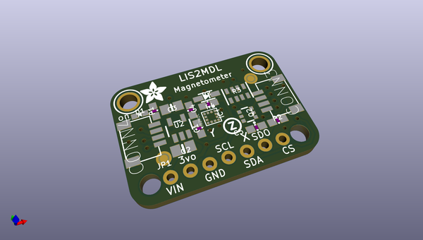
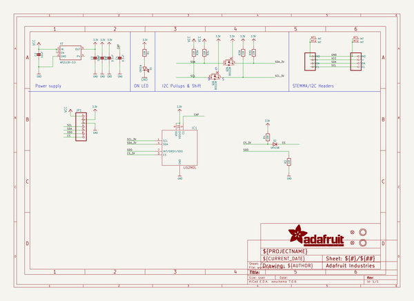
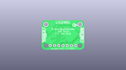
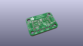
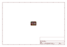
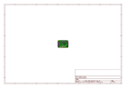
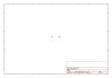
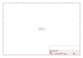

# OOMP Project  
## Adafruit-LIS2MDL-PCB  by adafruit  
  
oomp key: oomp_projects_flat_adafruit_adafruit_lis2mdl_pcb  
(snippet of original readme)  
  
-- Adafruit LIS2MDL 3-Axis Magnetometer PCB  
  
<a href="http://www.adafruit.com/products/4488">   
Click here to purchase one from the Adafruit shop</a>  
  
PCB files for the Adafruit LIS2MDL 3-Axis Magnetometer.   
  
Format is EagleCAD schematic and board layout  
* https://www.adafruit.com/product/4488  
  
--- Description  
  
Sense the magnetic fields that surround us with this handy triple-axis magnetometer (compass) module. Magnetometers can sense where the strongest magnetic force is coming from, generally used to detect magnetic north, but can also be used for measuring magnetic fields. This sensor tends to be paired with a 6-DoF (degree of freedom) accelerometer/gyroscope to create a 9-DoF inertial measurement unit that can detect its orientation in real-space thanks to Earth's stable magnetic field. It's a great match for any of our 6-DoF IMU sensors such as the LSM6DSOX or LSM6DS33.  
  
--- License  
  
Adafruit invests time and resources providing this open source design, please support Adafruit and open-source hardware by purchasing products from [Adafruit](https://www.adafruit.com)!  
  
Designed by Limor Fried/Ladyada for Adafruit Industries.  
  
Creative Commons Attribution/Share-Alike, all text above must be included in any redistribution.   
See license.txt for additional details.  
  
  full source readme at [readme_src.md](readme_src.md)  
  
source repo at: [https://github.com/adafruit/Adafruit-LIS2MDL-PCB](https://github.com/adafruit/Adafruit-LIS2MDL-PCB)  
## Board  
  
  
## Schematic  
  
  
  
[schematic pdf](working_schematic.pdf)  
## Images  
  
  
  
  
  
  
  
  
  
  
  
  
  
  
  
  
