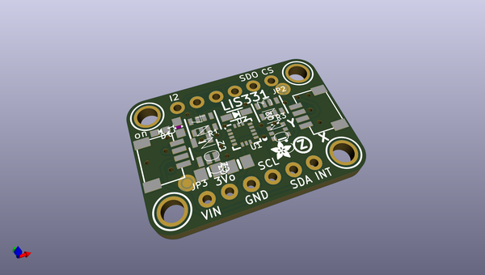
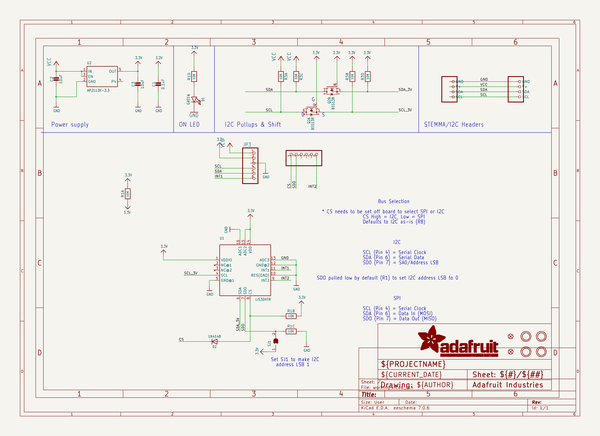
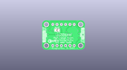
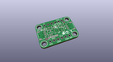
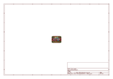
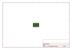
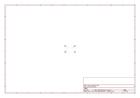
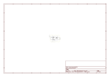

# OOMP Project  
## Adafruit-LIS331-PCB  by adafruit  
  
(snippet of original readme)  
  
-- PCB files for the Adafruit LIS331 Family of High-g 3-Axis Accelerometers  
--- LIS331HH  
<a href="http://www.adafruit.com/products/4626">   
Click here to purchase one from the Adafruit shop</a>  
--- H3LIS331  
<a href="http://www.adafruit.com/products/4627">   
Click here to purchase one from the Adafruit shop</a>  
--- Links  
PCB files for the Adafruit LIS331 Family of High-g 3-Axis Accelerometers.   
  
Format is EagleCAD schematic and board layout  
* https://www.adafruit.com/product/4626  
* https://www.adafruit.com/product/4627  
  
--- Description  
  
Accelerometers are becoming fairly common, and their clear connection to movement makes them a particularly good choice for learning about sensors in a tangible way. It’s not hard to find an accelerometer that can measure accelerations up to 16g, but if you need an accelerometer that can measure even larger amounts of acceleration, your options narrow. The ICM20649 is a great sensor and can measure up to ±30g, but it also comes with a magnetometer that you may not need for your project.  
  
Enter the LIS331 family of accelerometers from ST, including the H3LIS331 and LIS331HH. As their model numbers may suggest, the LIS331s are close cousins to the venerable LIS3DH accelerometer that is on every Circuit Playground, from the Circuit Playground Classic to the newest Circuit Playground Bluefruit. The LIS331s however can measure a wider range of a  
  full source readme at [readme_src.md](readme_src.md)  
  
source repo at: [https://github.com/adafruit/Adafruit-LIS331-PCB](https://github.com/adafruit/Adafruit-LIS331-PCB)  
## Board  
  
  
## Schematic  
  
  
  
[schematic pdf](working_schematic.pdf)  
## Images  
  
  
  
  
  
  
  
  
  
  
  
  
  
  
  
  
