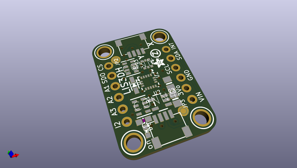
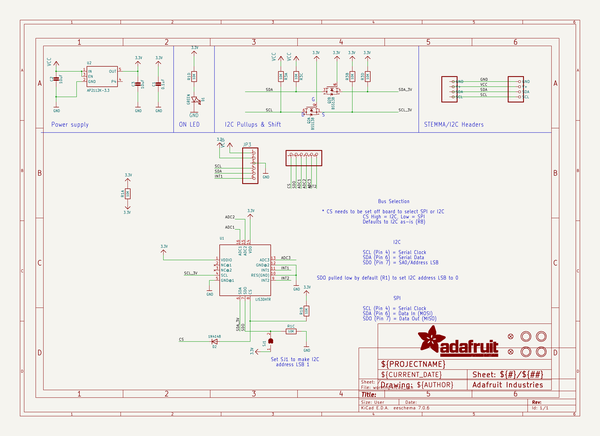
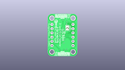
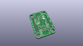
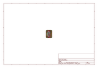
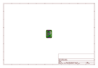
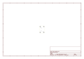
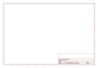
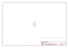

# OOMP Project  
## Adafruit-LIS3DH-Breakout-PCB  by adafruit  
  
oomp key: oomp_projects_flat_adafruit_adafruit_lis3dh_breakout_pcb  
(snippet of original readme)  
  
-- Adafruit LIS3DH Triple-Axis Accelerometer (+-2g/4g/8g/16g) PCB  
<a href="http://www.adafruit.com/products/2809">   
Click here to purchase one from the Adafruit shop</a>  
  
The LIS3DH is a very popular low power triple-axis accelerometer. It's low-cost, but has just about every 'extra' you'd want in an accelerometer:  
  
3.3V regulator + level shifting, so you can safely use with any Arduino or microcontroller without the need for an external level shifter!  
We kept seeing this accelerometer in teardowns of commercial products and figured that if it's the most-commonly used accelerometer, its worth having a breakout board!  
  
This sensor communicates over I2C or SPI (our library code supports both) so you can share it with a bunch of other sensors on the same I2C bus. There's an address selection pin so you can have two accelerometers share an I2C bus.  
  
To get you going fast, we spun up a custom made PCB in the STEMMA QT form factor, making them easy to interface with. The STEMMA QT connectors on either side are compatible with the SparkFun Qwiic I2C connectors. This allows you to make solderless connections between your development board and the LIS331s or to chain them with a wide range of other sensors and accessories using a compatible cable. We’ve of course broken out all the pins to standard headers and added a voltage regulator and level shifting so allow you to use it with either 3.3V or 5V systems such as the Raspberry Pi  
  full source readme at [readme_src.md](readme_src.md)  
  
source repo at: [https://github.com/adafruit/Adafruit-LIS3DH-Breakout-PCB](https://github.com/adafruit/Adafruit-LIS3DH-Breakout-PCB)  
## Board  
  
  
## Schematic  
  
  
  
[schematic pdf](working_schematic.pdf)  
## Images  
  
  
  
  
  
  
  
  
  
  
  
  
  
  
  
  
