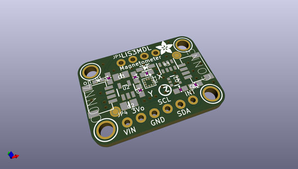
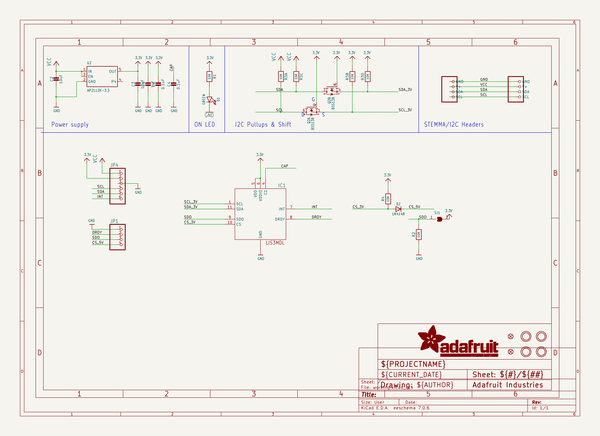
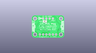
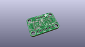
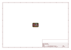
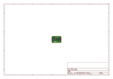
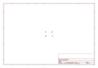
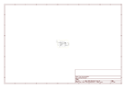

# OOMP Project  
## Adafruit-LIS3MDL-PCB  by adafruit  
  
(snippet of original readme)  
  
-- Adafruit LIS3MDL Triple-axis Magnetometer PCB  
  
<a href="http://www.adafruit.com/products/4479">   
Click here to purchase one from the Adafruit shop</a>  
  
PCB files for the Adafruit LIS3MDL Triple-axis Magnetometer.   
  
Format is EagleCAD schematic and board layout  
* https://www.adafruit.com/product/4479  
  
--- Description  
  
Sense the magnetic fields that surround us with this handy triple-axis magnetometer (compass) module. Magnetometers can sense where the strongest magnetic force is coming from, generally used to detect magnetic north, but can also be used for measuring magnetic fields. This sensor tends to be paired with a 6-DoF (degree of freedom) accelerometer/gyroscope to create a 9-DoF inertial measurement unit that can detect its orientation in real-space thanks to Earth's stable magnetic field. It's a great match for the LSM6DSOX from ST!  
  
We based this breakout on ST's LIS3MDL, a great general purpose magnetometer. This compact sensor uses I2C to communicate and its very easy to use. Simply download our library and connect the SCL pin to your I2C clock pin, and SDA pin to your I2C data pin and upload our test program to read out magnetic field data. If you'd like, you can also use SPI to receive data (we just happen to prefer I2C here)  
  
This sensor can sense ranges from +-4 gauss (+- 400 uTesla) up to +-16 gauss (+- 16uTesla). For ultra high precision, 155 Hz update rate is recommended - but if you don't mind a littl  
  full source readme at [readme_src.md](readme_src.md)  
  
source repo at: [https://github.com/adafruit/Adafruit-LIS3MDL-PCB](https://github.com/adafruit/Adafruit-LIS3MDL-PCB)  
## Board  
  
  
## Schematic  
  
  
  
[schematic pdf](working_schematic.pdf)  
## Images  
  
  
  
  
  
  
  
  
  
  
  
  
  
  
  
  
