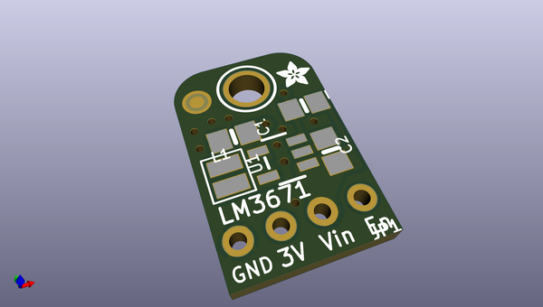
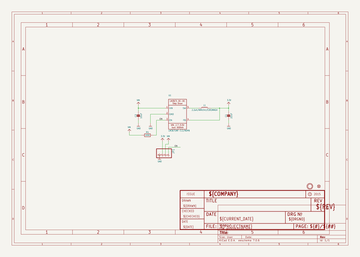
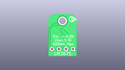
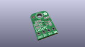
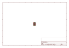
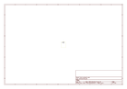
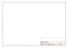
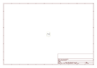

# OOMP Project  
## Adafruit-LM3671-Buck-Converter-PCB  by adafruit  
  
(snippet of original readme)  
  
-- Adafruit LM3671 Buck Converter PCB  
<a href="http://www.adafruit.com/products/2745">   
Click here to purchase one from the Adafruit shop</a>  
  
Your power supply problems just got SUPER SOLVED! This 3.3V Buck Converter Breakout board is great for supplying power to low voltage circuits from a single Li-Ion cell battery or USB power.  This chip provides up to 600-mA load current across the entire input voltage range of 3.5 to 5.5V.  Great for your portable project, we made this "pin compatible" with the LM1117-3.3V TO-220 chip so you can swap it in for better performance (90-95% efficiency!) There's also an ENable pin, tie it low to shut down the output completely.  
  
There's a 2-MHz fixed-frequency in PWM mode and PFM mode extends the battery life by reducing the current during light load or standby operation.  
  
PCB files for Adafruit LM3671 Buck Converter. The format is EagleCAD schematic and board layout  
- https://www.adafruit.com/product/2745  
  
--- License  
  
Adafruit invests time and resources providing this open source design, please support Adafruit and open-source hardware by purchasing products from [Adafruit](https://www.adafruit.com)!  
  
All text above must be included in any redistribution  
  
Designed by Limor Fried/Ladyada for Adafruit Industries.  
Creative Commons Attribution/Share-Alike, all text above must be included in any redistribution.   
See license.txt for additional information.  
  
  full source readme at [readme_src.md](readme_src.md)  
  
source repo at: [https://github.com/adafruit/Adafruit-LM3671-Buck-Converter-PCB](https://github.com/adafruit/Adafruit-LM3671-Buck-Converter-PCB)  
## Board  
  
  
## Schematic  
  
  
  
[schematic pdf](working_schematic.pdf)  
## Images  
  
  
  
  
  
  
  
  
  
  
  
  
  
  
  
  
