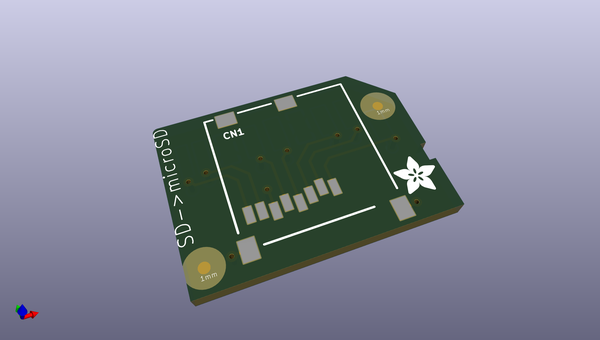
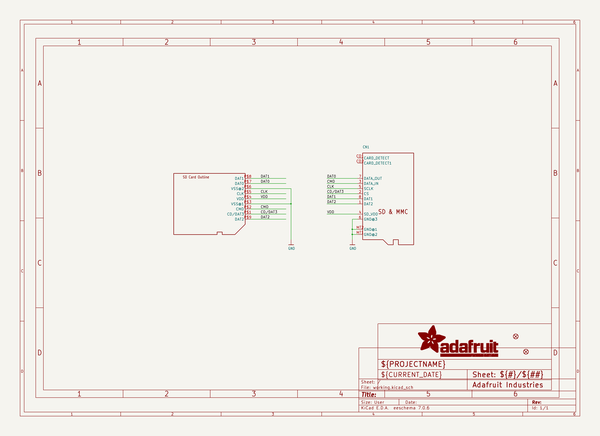
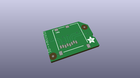
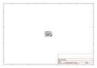
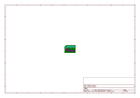
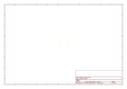
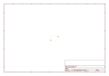
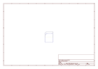

# OOMP Project  
## Adafruit-Low-profile-microSD-to-SD-Adapter-PCB  by adafruit  
  
oomp key: oomp_projects_flat_adafruit_adafruit_low_profile_microsd_to_sd_adapter_pcb  
(snippet of original readme)  
  
-- Adafruit Low profile microSD to SD Adapter PCB (discontinued)  
<a href="http://www.adafruit.com/products/966">   
Click here to view on the Adafruit website  
</a>  
  
PCB files for the Adafruit Low-profile microSD to SD Adapter. Format is EagleCAD schematic and board layout  
- https://www.adafruit.com/product/966  
  
This product has been discontinued.  
  
--- License  
  
Adafruit invests time and resources providing this open source design, please support Adafruit and open-source hardware by purchasing products from [Adafruit.com](https://www.adafruit.com)!  
  
Creative Commons Attribution, Share-Alike license, check license.txt for more information All text above must be included in any redistribution -   
See license.txt for more information.  
  
  full source readme at [readme_src.md](readme_src.md)  
  
source repo at: [https://github.com/adafruit/Adafruit-Low-profile-microSD-to-SD-Adapter-PCB](https://github.com/adafruit/Adafruit-Low-profile-microSD-to-SD-Adapter-PCB)  
## Board  
  
  
## Schematic  
  
  
  
[schematic pdf](working_schematic.pdf)  
## Images  
  
  
  
  
  
  
  
  
  
  
  
  
  
  
  
  
