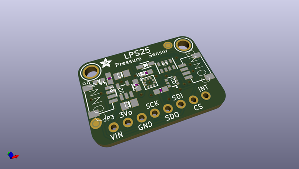
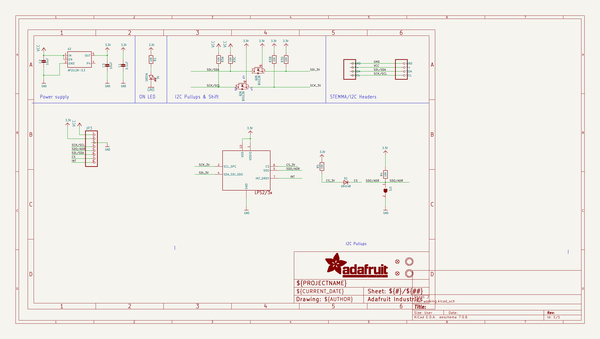
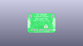
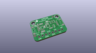
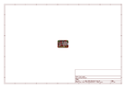
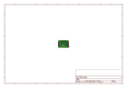
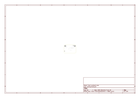
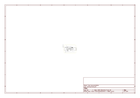

# OOMP Project  
## Adafruit-LPS2X-PCB  by adafruit  
  
oomp key: oomp_projects_flat_adafruit_adafruit_lps2x_pcb  
(snippet of original readme)  
  
-- Adafruit LPS2X family of absolute pressure sensors PCB  
  
<a href="http://www.adafruit.com/products/4530">  
<a href="http://www.adafruit.com/products/4633">  
    
Click here to purchase one from the Adafruit shop</a>  
  
PCB files for the Adafruit LPS2X family of absolute pressure sensors.   
  
Format is EagleCAD schematic and board layout  
* https://www.adafruit.com/product/4530  
* http://www.adafruit.com/products/4633  
  
--- Description  
  
We live on a planet with an atmosphere, a big ocean of gaseous air that keeps everything alive - and that atmosphere is constantly bouncing off of us, exerting air pressure on everything around us. But, how much air is in the atmosphere, bearing down on us?  
Absolute pressure sensors  like the **ST LPS22HB** or **ST LPS25HB** can quickly and easily measure this air pressure, useful when you want to know about the weather (are we in a low pressure or high pressure system?) or to determine altitude, as the air thins out the higher we get above sea level. For example, at sea level, the official pressure level is **1013.25 hPa**. You can use these sensors to measure the current pressure where you are right now, to compare.  
  
The LPS25 has a wide measurement range of **260-1260** hPa with 24-bit pressure data measurements that can be read up to **25 times a second (Hz)**, you can be confident that you always have an up to date and precise measurement. The LP  
  full source readme at [readme_src.md](readme_src.md)  
  
source repo at: [https://github.com/adafruit/Adafruit-LPS2X-PCB](https://github.com/adafruit/Adafruit-LPS2X-PCB)  
## Board  
  
  
## Schematic  
  
  
  
[schematic pdf](working_schematic.pdf)  
## Images  
  
  
  
  
  
  
  
  
  
  
  
  
  
  
  
  
