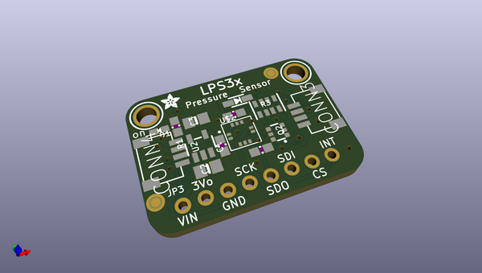
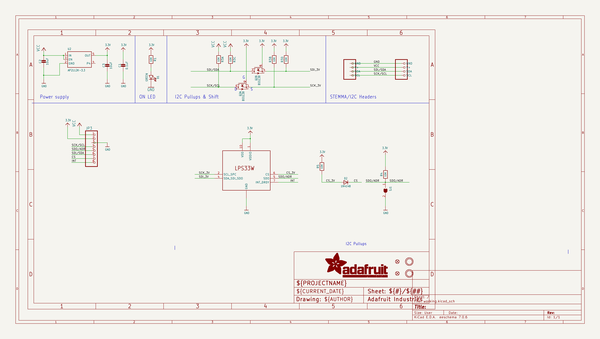
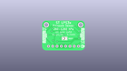
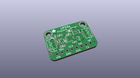
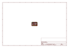
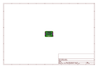
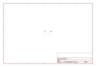
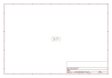

# OOMP Project  
## Adafruit-LPS3X-PCB  by adafruit  
  
(snippet of original readme)  
  
- Adafruit-LPS35X-PCB  
PCB files for the Adafruit LPS35HW and LPS33HW Breakouts  
  
Format is EagleCAD schematic and board layout  
  
For more details, check out the product page at  
  
   * https://www.adafruit.com/product/4258  
   * https://www.adafruit.com/product/4414  
  
Adafruit invests time and resources providing this open source design,   
please support Adafruit and open-source hardware by purchasing   
products from Adafruit!  
  
Designed by Adafruit Industries.    
Creative Commons Attribution, Share-Alike license, check license.txt for more information  
All text above must be included in any redistribution  
  
  full source readme at [readme_src.md](readme_src.md)  
  
source repo at: [https://github.com/adafruit/Adafruit-LPS3X-PCB](https://github.com/adafruit/Adafruit-LPS3X-PCB)  
## Board  
  
  
## Schematic  
  
  
  
[schematic pdf](working_schematic.pdf)  
## Images  
  
  
  
  
  
  
  
  
  
  
  
  
  
  
  
  
