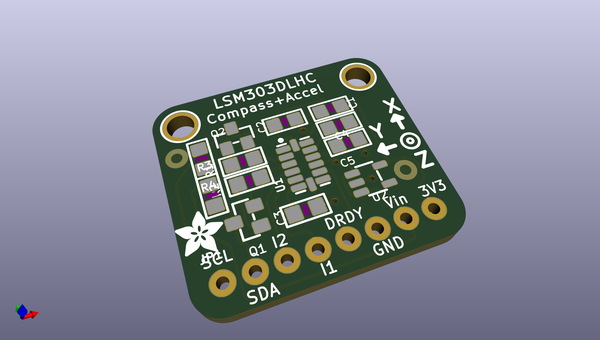
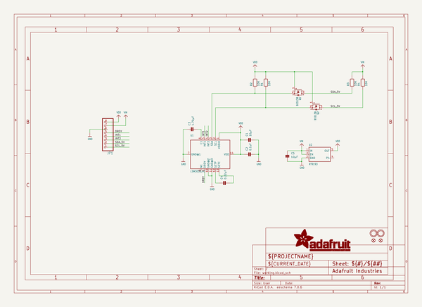
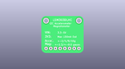
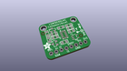
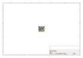
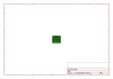
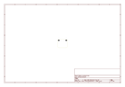
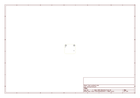
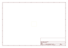
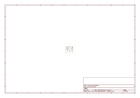

# OOMP Project  
## Adafruit-LSM303-PCB  by adafruit  
  
oomp key: oomp_projects_flat_adafruit_adafruit_lsm303_pcb  
(snippet of original readme)  
  
- PCB for the Adafruit LSM303 3-axis Compass + 3-axis Accelerometer  
  
<a href="http://www.adafruit.com/products/1120"> Click here to purchase one from the Adafruit shop</a>  
  
He told you "Go West, young maker!" - but you don't know which way is West! Ah, if only you had this triple-axis accelerometer/magnetometer compass module. Inside are two sensors, one is a classic 3-axis accelerometer, which can tell you which direction is down towards the Earth (by measuring gravity). The other is a magnetometer that can sense where the strongest magnetic force is coming from, generally used to detect magnetic north. By combining this data you can then orient your project!  
  
We based this breakout on the latest version of this popular sensor, the LSM303DLHC. This compact sensor uses I2C to communicate and its very easy to use. Since it's a 3.3V max chip, we added circuitry to make it 5V-safe logic and power, for easy use with either 3 or 5V microcontrollers. Simply connect VCC to +3-5V and ground to ground. Then read data from the I2C clock and data pins. There's also a Data Ready and two Interrupt pins you can use (check the LSM303 datasheet for details)  
  
If using with an Arduino, its extra-easy to get started as we already wrote a nice little Arduino library to get you started. Simply download our library and connect the SCL pin to your Arduino's I2C clock pin, and SDA pin to your Arduino's I2C data pin and upload our test program to  
  full source readme at [readme_src.md](readme_src.md)  
  
source repo at: [https://github.com/adafruit/Adafruit-LSM303-PCB](https://github.com/adafruit/Adafruit-LSM303-PCB)  
## Board  
  
  
## Schematic  
  
  
  
[schematic pdf](working_schematic.pdf)  
## Images  
  
  
  
  
  
  
  
  
  
  
  
  
  
  
  
  
