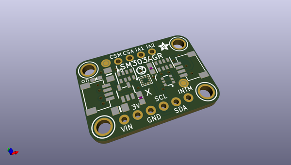
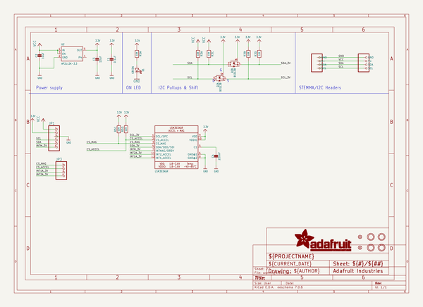
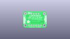
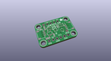
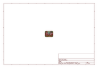
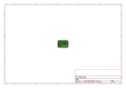
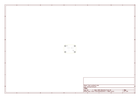
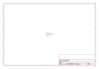

# OOMP Project  
## Adafruit-LSM303AGR-PCB  by adafruit  
  
(snippet of original readme)  
  
-- Adafruit LSM303AGR Triple-axis Accelerometer+Magnetometer PCB  
  
<a href="http://www.adafruit.com/products/4413">   
Click here to purchase one from the Adafruit shop</a>  
  
PCB files for the Adafruit LSM303AGR Triple-axis Accelerometer+Magnetometer.   
  
Format is EagleCAD schematic and board layout  
* https://www.adafruit.com/product/4413  
  
--- Description  
  
The LSM303 breakout board combines a magnetometer/compass module with a triple-axis accelerometer to make a compact navigation subsystem. The I2C interface is compatible with both 3.3v and 5v processors and the two pins can be shared by other I2C devices. Combined with a 3-axis gyro such as the L3GD20, you have all the sensors you need for a complete IMU (Inertial Measurement Unit) for use in aerial, terrestrial or marine navigation.  
  
--- License  
  
Adafruit invests time and resources providing this open source design, please support Adafruit and open-source hardware by purchasing products from [Adafruit](https://www.adafruit.com)!  
  
Designed by Bryan Siepert for Adafruit Industries.  
  
Creative Commons Attribution/Share-Alike, all text above must be included in any redistribution.   
See license.txt for additional details.  
  
  full source readme at [readme_src.md](readme_src.md)  
  
source repo at: [https://github.com/adafruit/Adafruit-LSM303AGR-PCB](https://github.com/adafruit/Adafruit-LSM303AGR-PCB)  
## Board  
  
  
## Schematic  
  
  
  
[schematic pdf](working_schematic.pdf)  
## Images  
  
  
  
  
  
  
  
  
  
  
  
  
  
  
  
  
