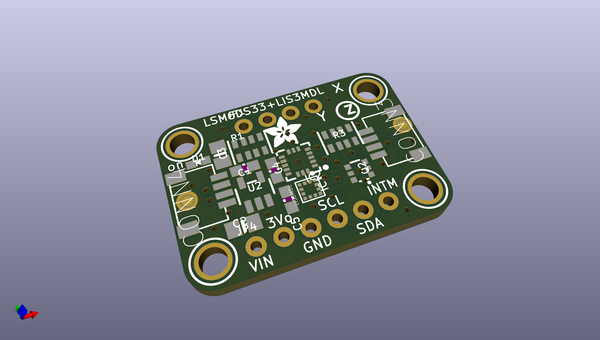
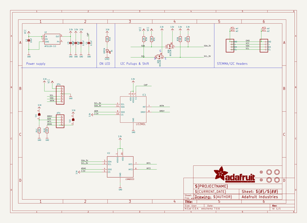
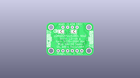
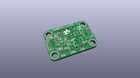
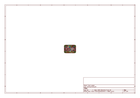
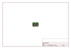
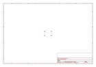
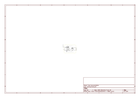

# OOMP Project  
## Adafruit-LSM6DS33-LIS3MDL-PCB  by adafruit  
  
oomp key: oomp_projects_flat_adafruit_adafruit_lsm6ds33_lis3mdl_pcb  
(snippet of original readme)  
  
-- Adafruit LSM6DS33 + LIS3MDL 9-DoF IMU with Accel/Gyro/Mag PCB  
  
<a href="http://www.adafruit.com/products/4485">   
Click here to purchase one from the Adafruit shop</a>  
  
PCB files for the Adafruit LSM6DS33 + LIS3MDL 9-DoF IMU with Accel/Gyro/Mag.  
  
Format is EagleCAD schematic and board layout  
* https://www.adafruit.com/product/4485  
  
--- Description  
  
Add motion, direction and orientation sensing to your Arduino project with this all-in-one 9 Degree of Freedom (9-DoF) sensor with sensors from ST. This little breakout contains two chips that sit side-by-side to provide 9 degrees of full motion data.  
  
The board includes an LSM6DS33, a 6-DoF IMU accelerometer + gyro. The 3-axis accelerometer, can tell you which direction is down towards the Earth (by measuring gravity) or how fast the board is accelerating in 3D space. The 3-axis gyroscope that can measure spin and twist. The three triple-axis sensors add up to 9 degrees of freedom.  
  
It also includes a LIS3MDL 3-axis magnetometer that can sense where the strongest magnetic force is coming from, generally used to detect magnetic north. By combining this data you can orient the board.  
  
These chips are not the newest motion sensors, but they are well-established and come at a great price. Together you have a nice 9 DoF IMU setup that is affordable for any project. Design your own activity or motion tracker with all the data...  
  
To make getting started fast and easy, we placed the  
  full source readme at [readme_src.md](readme_src.md)  
  
source repo at: [https://github.com/adafruit/Adafruit-LSM6DS33-LIS3MDL-PCB](https://github.com/adafruit/Adafruit-LSM6DS33-LIS3MDL-PCB)  
## Board  
  
  
## Schematic  
  
  
  
[schematic pdf](working_schematic.pdf)  
## Images  
  
  
  
  
  
  
  
  
  
  
  
  
  
  
  
  
