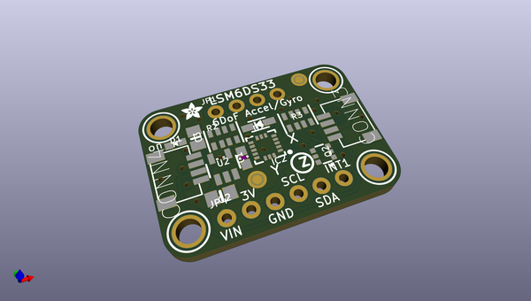
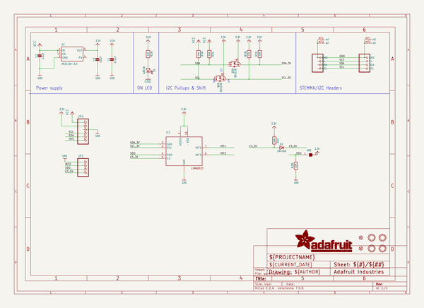
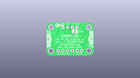
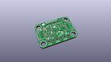
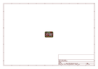
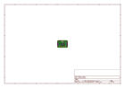
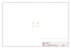
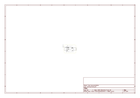

# OOMP Project  
## Adafruit-LSM6DS33-PCB  by adafruit  
  
oomp key: oomp_projects_flat_adafruit_adafruit_lsm6ds33_pcb  
(snippet of original readme)  
  
-- Adafruit LSM6DS33 6-DoF Accel+Gyro IMU PCB  
  
<a href="http://www.adafruit.com/products/4480">   
Click here to purchase one from the Adafruit shop</a>  
  
PCB files for the Adafruit LSM6DS33 6-DoF Accel+Gyro IMU.   
  
Format is EagleCAD schematic and board layout  
* https://www.adafruit.com/product/4480  
  
--- Description  
  
Add motion and orientation sensing to your Arduino project with this affordable 6 Degree of Freedom (6-DoF) sensor with sensors from ST. The board includes an **LSM6DS33**, a 6-DoF IMU accelerometer + gyro. The 3-axis accelerometer, can tell you which direction is down towards the Earth (by measuring gravity) or how fast the board is accelerating in 3D space. The 3-axis gyroscope that can measure spin and twist. This chip isn't the newest motion sensor, but it is well-established and comes at a great price.  
  
To make getting started fast and easy, we placed the sensors on a compact breakout board with voltage regulation and level-shifted inputs. That way you can use them with 3V or 5V power/logic devices without worry. Both I2C and SPI interfaces are available, so you'll be able to use it with any hardware setup. The breakout comes fully assembled and tested, with some extra header so you can use it on a breadboard. Four mounting holes make for a secure connection.  
  
This breakout does not include a magnetometer, often required for accurate orientation. We recommend the [LIS3MDL 3-axis magnetometer to match up with  
  full source readme at [readme_src.md](readme_src.md)  
  
source repo at: [https://github.com/adafruit/Adafruit-LSM6DS33-PCB](https://github.com/adafruit/Adafruit-LSM6DS33-PCB)  
## Board  
  
  
## Schematic  
  
  
  
[schematic pdf](working_schematic.pdf)  
## Images  
  
  
  
  
  
  
  
  
  
  
  
  
  
  
  
  
