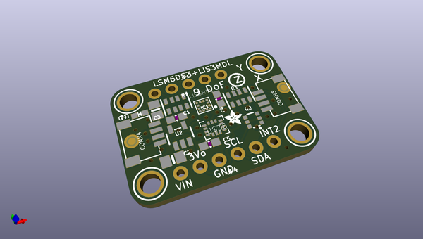
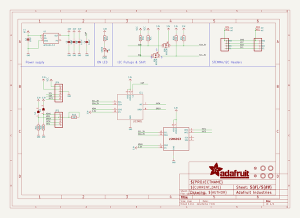

# OOMP Project  
## Adafruit-LSM6DS3TR-C-LIS3MDL-PCB  by adafruit  
  
oomp key: oomp_projects_flat_adafruit_adafruit_lsm6ds3tr_c_lis3mdl_pcb  
(snippet of original readme)  
  
-- Adafruit LSM6DS3TR-C + LIS3MDL  - Precision 9 DoF IMU - STEMMA QT / Qwiic PCB  
  
<a href="http://www.adafruit.com/products/5543">   
Click here to purchase one from the Adafruit shop</a>  
  
PCB files for the Adafruit LSM6DS3TR-C + LIS3MDL  - Precision 9 DoF IMU - STEMMA QT / Qwiic.   
  
Format is EagleCAD schematic and board layout  
* https://www.adafruit.com/product/5543  
  
--- Description  
  
Add high-quality motion, direction, and orientation sensing to your Arduino project with this all-in-one 9 Degree of Freedom (9-DoF) sensor with sensors from ST. This little breakout contains two chips that sit side-by-side to provide 9 degrees of full-motion data.  
  
The board includes an ST LSM6DS3TR-C (a.k.a LSM6DS3), a great entry-level 6-DoF IMU accelerometer + gyro. The 3-axis accelerometer can tell you which direction is down towards the Earth (by measuring gravity) or how fast the board is accelerating in 3D space. The 3-axis gyroscope can measure spin and twist.  
  
This chip is very similar to the now-discontinued LSM6DS33, a great entry-level IMU. As part of the illustrious LSM6DS family, it's well-established and well-supported, and this chip even has better performance! Note it is not firmware-compatible with the 'DS33, so you will need to recompile code (e.g our Arduino and Python libraries support the whole family but you do have to indicate which exact chip you're using)  
  
It also includes a LIS3MDL 3-axis magnetometer that can sense   
  full source readme at [readme_src.md](readme_src.md)  
  
source repo at: [https://github.com/adafruit/Adafruit-LSM6DS3TR-C-LIS3MDL-PCB](https://github.com/adafruit/Adafruit-LSM6DS3TR-C-LIS3MDL-PCB)  
## Board  
  
  
## Schematic  
  
  
  
[schematic pdf](working_schematic.pdf)  
## Images  
  
  
  
  
  
  
  
  
  
  
  
  
  
  
  
  
