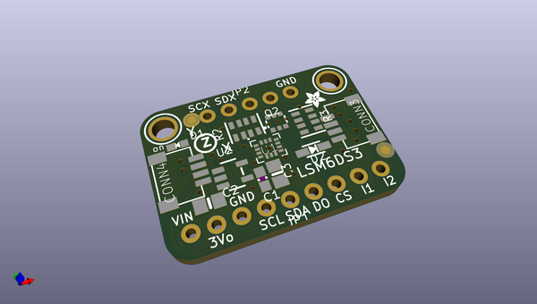
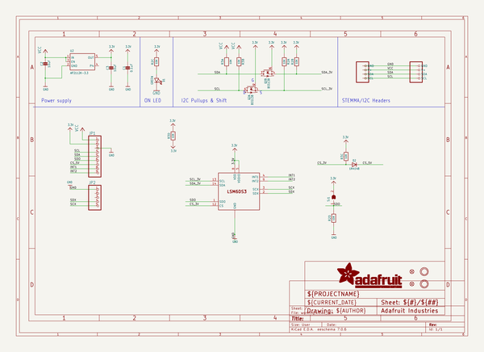
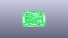
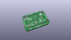
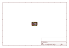
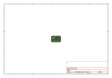
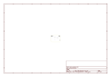
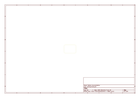
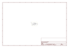

# OOMP Project  
## Adafruit-LSM6DS3TR-C-PCB  by adafruit  
  
oomp key: oomp_projects_flat_adafruit_adafruit_lsm6ds3tr_c_pcb  
(snippet of original readme)  
  
-- Adafruit LSM6DS3TR-C 6-DoF Accel + Gyro IMU - STEMMA QT / Qwiic PCB  
  
<a href="http://www.adafruit.com/products/4503">   
Click here to purchase one from the Adafruit shop</a>  
  
PCB files for the Adafruit LSM6DS3TR-C 6-DoF Accel + Gyro IMU - STEMMA QT / Qwiic.   
  
Format is EagleCAD schematic and board layout  
* https://www.adafruit.com/product/4503  
  
--- Description  
  
Add motion and orientation sensing to your Arduino project with this affordable 6 Degree of Freedom (6-DoF) sensor with sensors from ST. The board includes an ST LSM6DS3TR-C, a great entry-level 6-DoF IMU accelerometer + gyro. The 3-axis accelerometer can tell you which direction is down towards the Earth (by measuring gravity) or how fast the board is accelerating in 3D space. The 3-axis gyroscope can measure spin and twist.  
  
This chip is very similar to the now-discontinued LSM6DS33, a great entry-level IMU. As part of the illustrious LSM6DS family, its well-established, well-supported and this chip even has better performance! Note it is not firmware-compatible with the 'DS33, so you will need to recompile code (e.g our Arduino and Python libraries support the whole family but you do have to indicate which exact chip you're using)  
  
To make getting started fast and easy, we placed the sensors on a compact breakout board with voltage regulation and level-shifted inputs. That way you can use them with 3V or 5V power/logic devices without worry. Both I2C and SPI in  
  full source readme at [readme_src.md](readme_src.md)  
  
source repo at: [https://github.com/adafruit/Adafruit-LSM6DS3TR-C-PCB](https://github.com/adafruit/Adafruit-LSM6DS3TR-C-PCB)  
## Board  
  
  
## Schematic  
  
  
  
[schematic pdf](working_schematic.pdf)  
## Images  
  
  
  
  
  
  
  
  
  
  
  
  
  
  
  
  
