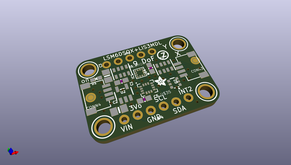
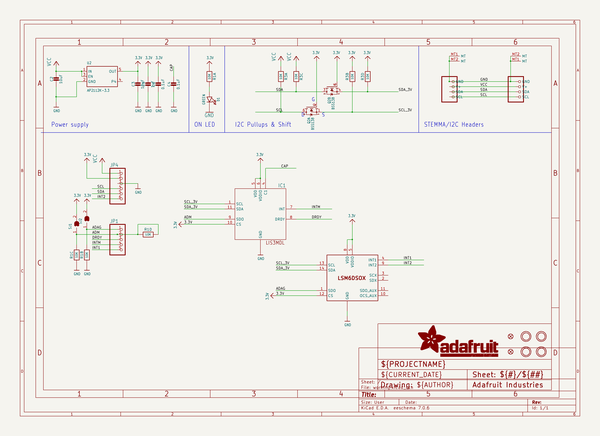
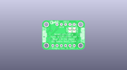
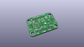
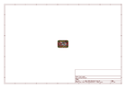
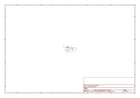

# OOMP Project  
## Adafruit-LSM6DSOX-LIS3MDL-PCB  by adafruit  
  
oomp key: oomp_projects_flat_adafruit_adafruit_lsm6dsox_lis3mdl_pcb  
(snippet of original readme)  
  
-- Adafruit LSM6DSOX + LIS3MDL Precision 9-DoF IMU PCBs  
  
<a href="http://www.adafruit.com/products/4517">   
<a href="http://www.adafruit.com/products/4565">   
Click here to purchase one from the Adafruit shop</a>  
  
PCB files for the Adafruit LSM6DSOX + LIS3MDL Precision 9-DoF IMU breakout and FeatherWing.  
  
Format is EagleCAD schematic and board layout  
* https://www.adafruit.com/product/4517  
  
--- Description  
  
Add high quality motion, direction and orientation sensing to your Arduino project with this all-in-one 9 Degree of Freedom (9-DoF) sensor with sensors from ST. This little breakout contains two chips that sit side-by-side to provide 9 degrees of full-motion data.  
  
The board includes an LSM6DSOX, a 6-DoF IMU accelerometer + gyro. The 3-axis accelerometer can tell you which direction is down towards the Earth (by measuring gravity) or how fast the board is accelerating in 3D space. The 3-axis gyroscope can measure spin and twist. This new sensor from ST has very low gyro zero rate and noise, compared to the MPU6050 or even LSM6DS33 so it's excellent for orientation fusion usage: you'll get less drift and faster responses.  
  
The LSM6DSOX has flexible data rates and ranges. For the accelerometer: ±2/±4/±8/±16 g at 1.6 Hz to 6.7KHz update rate. For the gyroscope: ±125/±250/±500/±1000/±2000 dps at 12.5 Hz to 6.7 KHz. There's also some nice extras, such as built in tap detect  
  full source readme at [readme_src.md](readme_src.md)  
  
source repo at: [https://github.com/adafruit/Adafruit-LSM6DSOX-LIS3MDL-PCB](https://github.com/adafruit/Adafruit-LSM6DSOX-LIS3MDL-PCB)  
## Board  
  
  
## Schematic  
  
  
  
[schematic pdf](working_schematic.pdf)  
## Images  
  
  
  
  
  
  
  
  
  
  
  
  
  
  
  
  
